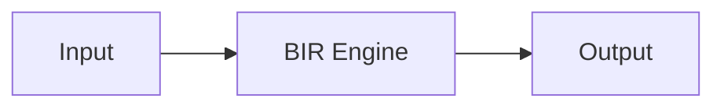

# MATRIX Documentation Style Guide

**Version:** 1.0 | **Last Updated:** 2026-09-20

---

## 1. Audience Layers

| Layer | Audience | Reading Level | Style |
|-------|----------|---------------|-------|
| **Story** | Everyone (12+) | Grade 8-10 | Narrative, analogies, visuals |
| **Engineer** | Developers | Professional | Tutorial, code-heavy, step-by-step |
| **Scientist** | Researchers | PhD-level | Academic, proofs, data-driven |
| **Archive** | Historians/Auditors | Technical | Logs, decisions, failures |

---

## 2. Tone & Voice

### General Rules
- **Active voice** preferred: "MATRIX learns" not "It is learned"
- **Present tense** for current behavior: "BIR achieves 75% accuracy"
- **No marketing fluff**: Every claim must be verifiable
- **Honest about limitations**

### Layer-Specific Tone

| Layer | Tone | Example |
|-------|------|---------|
| Story | Warm, wonder-driven | "What if your AI could dream?" |
| Engineer | Direct, practical | "Run `./gradlew test`" |
| Scientist | Precise, evidence-based | "Under these conditions, p < 0.01" |
| Archive | Neutral, factual | "2026-09-20: Wave 655 committed" |

---

## 3. Diagrams (Mermaid.js)

| Diagram Type | Use When |
|-------------|----------|
| `graph LR/TD` | Architecture, data flow |
| `sequenceDiagram` | Interactions over time |
| `stateDiagram-v2` | State machines |

---

## 4. Math Notation (LaTeX)

- Inline: `$\Phi = \sum w_i x_i$`
- Block: `$$\Phi(x) = \sigma(\sum w_i x_i + b)$$`
- **Every formula needs a numeric example**

---

## 5. Code Snippets

- **Tested**: All code must be runnable
- **Complete**: Include imports and expected output
- **Copy-paste ready**: No placeholder values

---

## 6. Evidence Requirements

Every claim MUST link to:
- A passing test: `[BiochemicalNetworkTest](...)`
- A benchmark: `[BENCHMARK-REPORT-W620.md](...)`
- A TLA+ spec: `[Federation.tla](...)`

---

## 7. Readability Targets

| Layer | Flesch-Kincaid | Max Sentence |
|-------|---------------|--------------|
| Story | Grade 8-10 | 20 words |
| Engineer | Grade 12-14 | 25 words |
| Scientist | Grade 16+ | Variable |

---

## 8. File Naming

- Lowercase with hyphens: `biochemical-network.md`
- Descriptive: `getting-started.md`
- Versioned for research: `BENCHMARK-REPORT-W620.md`

---

*This style guide is a living document.*
