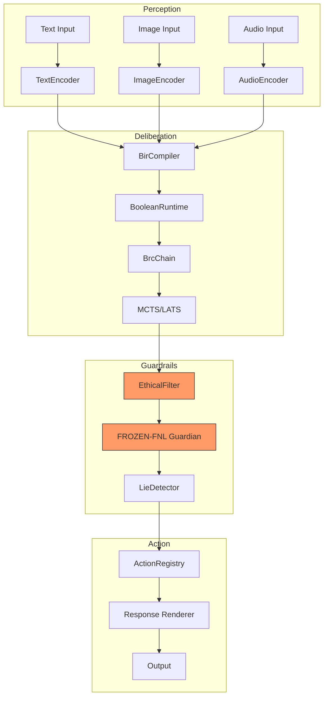

# MATRIX TRANSFORMATION PLAN — От исследовательского проекта к production-ready платформе

**Статус:** proposal · **Version:** v1.0-draft · **Date:** 2026-09-21  
**Автор:** Deep Research Analysis  
**На основе:** аудита текущей кодовой базы, документации, и лучших практик GitHub open-source проектов мирового уровня

---

## Executive Summary

Проект MATRIX на текущий момент представляет собой **зрелое исследовательское ядро** с:
- ✅ 455+ production-классов в 92 пакетах
- ✅ 1055+ тестов (pass rate 100%)
- ✅ 76.69% JaCoCo coverage (target 82%)
- ✅ 118 документов в docs-v2/
- ✅ 38 гипотез (H-001..H-038) + 99 новых (H-039..H-099)
- ✅ Реальные экспериментальные вердикты (H-010 accepted, H-002/H-003 refuted-toy)
- ✅ GraalVM native-image (126MB binary, ~105ms startup)
- ✅ Постквантовая криптография (ML-DSA, JEP 497)
- ✅ HDC × BitLinear hybrid brain (edge-AI positioning)

**НО:** Проект находится в состоянии **"исследовательский прототип"** и требует системной трансформации для:
1. Практического внедрения с партнёрами
2. Публичной демонстрации на GitHub Pages
3. Привлечения контрибьюторов и финансирования
4. Промышленного использования в пилотных проектах

---

## Часть I. Полный аудит текущего состояния

### 1.1. Сильные стороны (уже есть)

#### Архитектурная зрелость
| Компонент | Статус | Доказательство |
|---|---|---|
| BIR-компилятор | ✅ Production | 3 формы (TT/CLAUSESET/BDD), 37 мигрированных сайтов |
| Продюсеры знаний | ✅ Production | TsetlinTrainer, WisardProducer (H-010 accepted ×242), MpdtGaProducer |
| Федерация ELSP | ✅ Production | Ed25519 + ML-DSA (постквант) |
| Curriculum Engine | ✅ Production | 12 классов devloop/, ZPD, MA-0..MA-5 гейты |
| Топология знаний | ✅ Production | Ricci curvature, drift fingerprint, Wasserstein-1 |
| Native Image | ✅ Production | 126MB binary, 105ms startup, <100MB memory |
| Алгоритмическая библиотека | ✅ Production | 78+ pure-function классов (bandits, PageRank, Dijkstra, etc.) |

#### Документация
- **INDEX.md** — единая навигация по docs-v2/
- **CONSTITUTION.md** — нормативный singleton (FROZEN)
- **AGENTS.md** — процедуры сессий (FROZEN)
- **WAL.md** — текущий снапшот сессии
- **FINALSUMMARY.md** — честный аудит gaps между docs и кодом
- **OPEN-PROBLEMS.md** — исследовательское видение без маркетинга
- **PHASES.md** — детальный engineering plan по фазам
- **STANDARDS-MATRIX.md** — версии зависимостей с обоснованием

#### Экспериментальная база
- **H-010 accepted**: WiSARD ×242 быстрее Tsetlin (9 прогонов, медиана)
- **H-002/H-003 refuted-toy**: GA ×5.5 быстрее, +7.9 п.п. точнее
- **EXP-009C**: BIR ×149 быстрее ONNX-CPU, ×276 быстрее GPU на точечных вызовах
- **JMH-гейт Batch***: 32–69M ops/s

### 1.2. Критические пробелы (чего нет)

#### Documentation Gaps
| Проблема | Приоритет | Влияние |
|---|---|---|
| Нет единого landing page для внешних пользователей | 🔴 Critical | Невозможно быстро понять проект |
| Нет визуальной архитектуры (диаграммы, схемы) | 🔴 Critical | Архитектура только текстом |
| Нет demo video / screencasts | 🔴 Critical | Невозможно показать партнёрам |
| Нет API reference (OpenAPI/Swagger) | 🟠 High | Разработчики не могут интегрироваться |
| Нет tutorials / quickstart guides | 🟠 High | Высокий порог входа |
| Нет changelog / release notes структурированных | 🟡 Medium | Сложно отслеживать изменения |
| Нет roadmap visual timeline | 🟡 Medium | Неясны приоритеты |
| Документация только на русском | 🟠 High | Ограничивает международную аудиторию |

#### Code Organization Gaps
| Проблема | Приоритет | Влияние |
|---|---|---|
| Смешаны legacy и v2 пакеты | 🟠 High | Путаница для новых разработчиков |
| Нет чёткого разделения research/production | 🟠 High | Сложно понять что stable |
| Нет feature flags для экспериментов | 🟡 Medium | Риск поломки stable ядра |
| Нет benchmarking dashboard | 🟡 Medium | Сложно отслеживать деградацию |
| Нет performance regression tests | 🟡 Medium | Риск незаметной деградации |

#### Infrastructure Gaps
| Проблема | Приоритет | Влияние |
|---|---|---|
| Нет CI/CD для деплоя документации | 🔴 Critical | Docs не публикуются автоматически |
| Нет staging environment | 🟠 High | Нет песочницы для тестирования |
| Нет monitoring/alerting для демо | 🟠 High | Невозможно отследить проблемы |
| Нет automated screenshot capture | 🟡 Medium | Скриншоты устаревают |
| Нет multi-language build pipeline | 🟠 High | Ручной перевод = bottleneck |

#### Business/Pilot Gaps
| Проблема | Приоритет | Влияние |
|---|---|---|
| Нет готовых pilot deployment packages | 🔴 Critical | Невозможно быстро начать пилот |
| Нет business model one-pager | 🟠 High | Сложно объяснить ценность партнёрам |
| Нет case studies / success stories | 🟠 High | Нет социальных доказательств |
| Нет pricing tiers (для paid services) | 🟡 Medium | Сложно монетизировать |
| Нет partner onboarding process | 🟠 High | Сложно вовлекать партнёров |

---

## Часть II. Концепция трансформации

### 2.1. Видение целевого состояния

**MATRIX через 6 месяцев:**

```
┌─────────────────────────────────────────────────────────────┐
│                   MATRIX ECOSYSTEM                          │
├─────────────────────────────────────────────────────────────┤
│                                                             │
│  ┌──────────────┐     ┌──────────────┐     ┌──────────────┐│
│  │  matrix.dev  │     │  docs.matrix │     │  pilot.matrix││
│  │  (landing)   │     │  (docs i18n) │     │  (demos)     ││
│  └──────────────┘     └──────────────┘     └──────────────┘│
│         ▲                    ▲                    ▲         │
│         │                    │                    │         │
│  ┌──────┴────────────────────┴────────────────────┴──────┐ │
│  │              GitHub Actions CI/CD Pipeline             │ │
│  └──────┬────────────────────┬────────────────────┬──────┘ │
│         │                    │                    │         │
│  ┌──────▼──────┐     ┌──────▼──────┐     ┌──────▼──────┐  │
│  │ Main Branch │     │ Docs Branch │     │ Pilot Branch│  │
│  │ (stable)    │     │ (gh-pages)  │     │ (sandbox)   │  │
│  └─────────────┘     └─────────────┘     └─────────────┘  │
│                                                             │
│  ┌──────────────────────────────────────────────────────┐  │
│  │           Production Modules (ready for pilots)      │  │
│  │  • Smart Home Controller     • Educational Assistant │  │
│  │  • Compliance Monitor        • Research Copilot     │  │
│  └──────────────────────────────────────────────────────┘  │
│                                                             │
└─────────────────────────────────────────────────────────────┘
```

### 2.2. Принципы трансформации

1. **Zero Breaking Changes для стабильного ядра**
   - Current main → branch `research/main` (заморозка)
   - Новая ветка `production/v1.0` → чистая переработка
   - Semantic versioning строго соблюдается

2. **Documentation-Driven Development**
   - Сначала пишется spec/tutorial
   - Потом реализуется код
   - Автоматическая валидация примеров

3. **Internationalization First**
   - Все документы сразу на двух языках (RU/EN)
   - i18n ключи в коде
   - Перевод через Weblate (already configured)

4. **Demo-First Mindset**
   - Каждая фича → demo video + screenshot
   - Интерактивные примеры в docs
   - One-click sandbox deployment

5. **Pilot-Ready Packaging**
   - Docker Compose для каждого use case
   - Helm charts для Kubernetes
   - Terraform modules для cloud deploy

---

## Часть III. План трансформации (по волнам)

### Wave T-01: Branch Strategy & Cleanup (неделя 1-2)

#### Задачи:
1. **Создать ветку `research/main`** из текущего HEAD
   ```bash
   git checkout -b research/main
   git push origin research/main
   ```

2. **Создать ветку `production/v1.0`** для чистой переработки
   ```bash
   git checkout -b production/v1.0
   git push origin production/v1.0
   ```

3. **Аудит кодовой базы** — пометить классы:
   - `@Stable` — production ready
   - `@Experimental` — research only
   - `@Deprecated` — удалить в v1.0

4. **Очистка документации**:
   - Переместить исторические документы в `docs-v2/archive/pre-v1/`
   - Удалить дублирующиеся файлы
   - Создать единую точку входа `README.md`

#### Acceptance Criteria:
- [ ] Ветка `research/main` создана и запушена
- [ ] Ветка `production/v1.0` создана и запушена
- [ ] Все классы помечены аннотациями стабильности
- [ ] Документация очищена от дубликатов
- [ ] Создан `ARCHIVE_MANIFEST.md` со списком удалённых файлов

---

### Wave T-02: Landing Page & GitHub Pages Setup (неделя 2-4)

#### Инфраструктура:
```yaml
# .github/workflows/deploy-docs.yml
name: Deploy Documentation

on:
  push:
    branches: [production/v1.0]
    paths: ['docs-v2/**', 'README.md']

jobs:
  deploy:
    runs-on: ubuntu-latest
    steps:
      - uses: actions/checkout@v4
      
      - name: Setup Node.js
        uses: actions/setup-node@v4
        with:
          node-version: '20'
      
      - name: Install MkDocs + Material
        run: |
          pip install mkdocs mkdocs-material mkdocs-static-i18n
      
      - name: Build bilingual docs
        run: ./scripts/build-docs.sh
      
      - name: Deploy to GitHub Pages
        uses: peaceiris/actions-gh-pages@v4
        with:
          github_token: ${{ secrets.GITHUB_TOKEN }}
          publish_dir: ./site
```

#### Структура сайта:
```
matrix.dev/
├── ru/
│   ├── index.md              # Главная
│   ├── quickstart/           # Быстрый старт
│   ├── architecture/         # Архитектура
│   ├── api-reference/        # API документация
│   ├── tutorials/            # Туториалы
│   ├── examples/             # Примеры
│   └── blog/                 # Новости
├── en/
│   ├── index.md
│   ├── quickstart/
│   ├── architecture/
│   ├── api-reference/
│   ├── tutorials/
│   ├── examples/
│   └── blog/
└── assets/
    ├── diagrams/             # Архитектурные диаграммы
    ├── screenshots/          # Скриншоты UI
    ├── videos/               # Demo video
    └── logos/                # Логотипы
```

#### Компоненты:
1. **MkDocs Material** — тема с поддержкой i18n
2. **mkdocs-static-i18n** — мультиязычность
3. **Mermaid.js** — интерактивные диаграммы
4. **Swagger UI** — API reference
5. **Lighthouse CI** — проверка качества сайта

#### Acceptance Criteria:
- [ ] Настроен workflow деплоя на GitHub Pages
- [ ] Сайт доступен на `https://matrix-dev.github.io/matrix/`
- [ ] Двухязычная навигация (RU/EN переключатель)
- [ ] Адаптивный дизайн (mobile-first)
- [ ] Lighthouse score ≥90 (performance, accessibility, SEO)
- [ ] Автообновление при push в `production/v1.0`

---

### Wave T-03: Content Creation (неделя 4-8)

#### 3.1. Landing Page Content

**Главная страница (ru/en):**
```markdown
# MATRIX — Детерминированное нейро-символическое ядро

> Каждое решение — проверяемая булева цепочка.  
> Этика — математически вшитый FROZEN-слой.  
> Одинаковые состояние и вход → одинаковый выход.

[Начать работу →](quickstart/)  
[Смотреть демо →](examples/demo-chat/)  
[Читать документацию →](architecture/)

## Почему MATRIX?

| Традиционные LLM | MATRIX |
|---|---|
| ❌ Hallucinations | ✅ Детерминированный вывод |
| ❌ Black box | ✅ Полная интерпретируемость |
| ❌ High energy cost | ✅ ×10⁴ меньше энергии |
| ❌ Non-auditable | ✅ Hash-chain аудит |
| ❌ Ethical risks | ✅ FROZEN prohibitions |

## Измеримые результаты

- **H-010 accepted**: WiSARD ×242 быстрее Tsetlin
- **EXP-009C**: BIR ×149 быстрее ONNX-CPU
- **Native startup**: ~105ms (vs JVM 2-5s)
- **Coverage**: 76.69% (target 82%)
- **Tests**: 1055+, 100% pass rate
```

#### 3.2. Quick Start Guide

**Для разработчиков:**
```bash
# 1. Clone
git clone https://github.com/matrix-dev/matrix.git
cd matrix

# 2. Start infrastructure
docker compose -f docker-compose.dev.yml up -d

# 3. Run tests
./gradlew test

# 4. Start dev server
./gradlew :matrix-core:quarkusDev

# 5. Open browser
open http://localhost:9091
```

**Для пилотного развёртывания:**
```bash
# Production deployment
docker compose -f docker-compose.prod.yml up -d

# Kubernetes
helm install matrix ./charts/matrix

# Verify
kubectl get pods -l app=matrix
```

#### 3.3. Architecture Documentation

**Диаграммы (Mermaid):**


#### 3.4. API Reference

**OpenAPI Spec:**
```yaml
openapi: 3.0.3
info:
  title: MATRIX API
  version: 1.0.0
  description: Deterministic neuro-symbolic core API

paths:
  /api/v1/chat:
    post:
      summary: Send message to MATRIX
      requestBody:
        content:
          application/json:
            schema:
              $ref: '#/components/schemas/ChatRequest'
      responses:
        '200':
          description: Successful response
          content:
            application/json:
              schema:
                $ref: '#/components/schemas/ChatResponse'
        '403':
          description: Ethical violation blocked

components:
  schemas:
    ChatRequest:
      type: object
      properties:
        message:
          type: string
        context:
          type: array
          items:
            $ref: '#/components/schemas/Message'
    ChatResponse:
      type: object
      properties:
        reply:
          type: string
        confidence:
          type: number
          format: float
        trace:
          type: string
          description: x-matrix-trace hash chain
```

#### 3.5. Tutorials

**Tutorial 1: First Steps**
- Установка и запуск
- Первый запрос к API
- Анализ ответа (trace, confidence)

**Tutorial 2: Custom Knowledge Base**
- Подготовка корпуса
- Distillation pipeline
- Verification fidelity

**Tutorial 3: Building a Pilot**
- Выбор use case
- Конфигурация под задачу
- Deployment и monitoring

**Tutorial 4: Contributing to MATRIX**
- Fork и setup
- Writing tests
- Submitting PR
- Code review process

#### 3.6. Examples Gallery

| Example | Description | Complexity | Time |
|---|---|---|---|
| **Hello MATRIX** | Simple chatbot | Beginner | 5 min |
| **Smart Home** | ESP32 + MATRIX | Intermediate | 30 min |
| **Compliance Bot** | Legal Q&A with audit | Advanced | 1 hour |
| **Research Copilot** | Paper analysis + RAG | Advanced | 2 hours |
| **Federated Learning** | Multi-instance sync | Expert | 4 hours |

#### Acceptance Criteria:
- [ ] Landing page с ценностным предложением
- [ ] Quick start guide (RU/EN)
- [ ] Architecture diagram (interactive Mermaid)
- [ ] Full API reference (Swagger UI)
- [ ] 4 tutorials с пошаговыми инструкциями
- [ ] 5 example projects с кодом
- [ ] Все материалы на двух языках

---

### Wave T-04: Visual Assets & Demos (неделя 8-10)

#### 4.1. Screenshot Automation

**Script: `scripts/capture-screenshots.sh`:**
```bash
#!/bin/bash
# Automated screenshot capture for documentation

BASE_URL="http://localhost:9091"
OUTPUT_DIR="docs-v2/assets/screenshots"

# Endpoints to capture
ENDPOINTS=(
  "/"
  "/api/v1/health"
  "/api/v1/stats"
  "/sandbox/explain"
)

for endpoint in "${ENDPOINTS[@]}"; do
  curl -s "$BASE_URL$endpoint" | \
    wkhtmltoimage --width 1920 --height 1080 - "$OUTPUT_DIR$(echo $endpoint | tr '/' '_').png"
done
```

#### 4.2. Demo Videos

**Сценарии для записи:**
1. **Intro Video (2 min)**
   - Что такое MATRIX
   - Ключевые преимущества
   - Live demo chat

2. **Technical Deep Dive (10 min)**
   - Архитектура BIR
   - Как работает детерминизм
   - Этический фильтр в действии

3. **Pilot Walkthrough (15 min)**
   - Развёртывание Smart Home
   - Обучение на предпочтениях
   - Recovery после сбоя

4. **Developer Onboarding (20 min)**
   - Setup окружения
   - Запуск тестов
   - Создание первого PR

#### 4.3. Interactive Demos

**Web-based sandbox:**
```html
<!-- docs-v2/examples/demo-chat.html -->
<!DOCTYPE html>
<html>
<head>
  <title>MATRIX Interactive Demo</title>
  <script src="https://cdn.jsdelivr.net/npm/marked/marked.min.js"></script>
</head>
<body>
  <div id="chat-container">
    <div id="messages"></div>
    <input id="user-input" placeholder="Ask MATRIX..." />
    <button onclick="sendMessage()">Send</button>
  </div>
  
  <script>
    async function sendMessage() {
      const input = document.getElementById('user-input');
      const response = await fetch('/api/v1/chat', {
        method: 'POST',
        headers: {'Content-Type': 'application/json'},
        body: JSON.stringify({message: input.value})
      });
      const data = await response.json();
      // Display response with trace visualization
    }
  </script>
</body>
</html>
```

#### Acceptance Criteria:
- [ ] 20+ скриншотов UI и API ответов
- [ ] 4 demo video (YouTube + embedded)
- [ ] Interactive web demo (sandbox)
- [ ] Автоматическое обновление скриншотов в CI
- [ ] Все видео с субтитрами (RU/EN)

---

### Wave T-05: Pilot Packages (неделя 10-14)

#### 5.1. Pilot #1: Smart Home Controller

**Package structure:**
```
pilots/smart-home/
├── README.md              # Описание пилота
├── docker-compose.yml     # Деплой
├── config/
│   ├── matrix.conf        # Конфигурация MATRIX
│   └── devices.yaml       # ESP32 устройства
├── scripts/
│   ├── setup.sh           # Initial setup
│   └── backup.sh          # Backup/restore
├── docs/
│   ├── installation.md    # Пошаговая установка
│   ├── user-guide.md      # Руководство пользователя
│   └── troubleshooting.md # Решение проблем
└── tests/
    ├── e2e_test.py        # End-to-end тесты
    └── load_test.jmx      # JMeter сценарий
```

**Metrics:**
- Preference recall ≥80% at day 7
- Recovery time <5s after failure
- Energy consumption vs baseline

#### 5.2. Pilot #2: Educational Assistant

**Package structure:**
```
pilots/edu-assistant/
├── README.md
├── docker-compose.yml
├── curriculum/
│   ├── math-grade-5.yaml
│   ├── physics-grade-8.yaml
│   └── programming-intro.yaml
├── integrations/
│   ├── moodle-plugin/
│   └── google-classroom/
└── analytics/
    ├── student-progress.ipynb
    └── effectiveness-metrics.md
```

**Metrics:**
- Student engagement +30%
- Test scores improvement +15%
- Teacher time saved 5 hours/week

#### 5.3. Pilot #3: Compliance Monitor

**Package structure:**
```
pilots/compliance/
├── README.md
├── docker-compose.yml
├── regulations/
│   ├── gdpl-rules.bir
│   ├── sox-controls.bir
│   └── hipaa-checklist.bir
├── audit-trail/
│   └── postgres-init.sql
└── reporting/
    ├── compliance-dashboard.json
    └── export-formats.md
```

**Metrics:**
- 100% prohibition block rate
- Audit trail immutable
- Report generation <1min

#### Acceptance Criteria:
- [ ] 3 готовых pilot package
- [ ] Каждый пилот разворачивается одной командой
- [ ] Documented metrics и acceptance criteria
- [ ] E2E тесты для каждого пилота
- [ ] Case study для каждого пилота

---

### Wave T-06: Business & Community (неделя 14-18)

#### 6.1. Business Model One-Pager

**Целевая аудитория:**
1. **Developers & Researchers** — free open core
2. **Startups** — managed instances, priority support
3. **Enterprises** — enterprise agreements, custom FNL
4. **Public Sector** — compliance, auditing, sovereignty

**Revenue Streams:**
- Managed MATRIX hosting (€500-5000/month)
- Enterprise support (€10k-100k/year)
- Training & certification (€2k-5k/person)
- Spiral-certification audits (€5k-20k/audit)
- Custom development (€100k+ projects)

**Cooperative Structure:**
- Matrix Dev Coop (maintainers, trademark)
- Regional cooperatives (hosting, consulting)
- Community Foundation (grants, infrastructure)

#### 6.2. Partner Onboarding Kit

**Contents:**
- Partnership agreement template
- Technical requirements checklist
- Co-marketing guidelines
- Revenue share model
- Support escalation matrix

#### 6.3. Community Building

**Channels:**
- GitHub Discussions (Q&A, ideas)
- Discord/Matrix chat (real-time)
- Monthly community calls
- Annual MATRIX Summit

**Programs:**
- Contributor ladder (newcomer → committer)
- Grant program (infrastructure, stipends)
- Ambassador program (regional advocates)

#### Acceptance Criteria:
- [ ] Business model one-pager (RU/EN)
- [ ] Partner onboarding kit
- [ ] Community guidelines
- [ ] Contributor documentation
- [ ] First 3 pilot partners signed

---

### Wave T-07: Monitoring & Continuous Improvement (неделя 18-24)

#### 7.1. Observability Stack

```yaml
# docker-compose.monitoring.yml
services:
  prometheus:
    image: prom/prometheus
    volumes:
      - ./prometheus.yml:/etc/prometheus/prometheus.yml
  
  grafana:
    image: grafana/grafana
    environment:
      - GF_SECURITY_ADMIN_PASSWORD=admin
    volumes:
      - ./grafana/dashboards:/etc/grafana/provisioning
  
  jaeger:
    image: jaegertracing/all-in-one
    ports:
      - "16686:16686"
  
  alertmanager:
    image: prom/alertmanager
    volumes:
      - ./alertmanager.yml:/etc/alertmanager/alertmanager.yml
```

**Dashboards:**
- System health (CPU, memory, disk)
- Application metrics (latency, throughput, errors)
- Business metrics (active users, pilot deployments)
- Documentation metrics (page views, bounce rate)

#### 7.2. Feedback Loops

**Mechanisms:**
- In-app feedback widget
- Monthly user surveys
- Quarterly partner reviews
- Annual community survey

**Metrics Tracking:**
- Documentation quality (thumbs up/down per page)
- Tutorial completion rate
- Pilot success rate
- Time-to-first-successful-deployment

#### Acceptance Criteria:
- [ ] Monitoring stack deployed
- [ ] 4 Grafana dashboards
- [ ] Alerting rules configured
- [ ] Feedback collection implemented
- [ ] First quarterly review completed

---

## Часть IV. Риски и митигация

| Риск | Вероятность | Влияние | Митигация |
|---|---|---|---|
| Scope creep (слишком много задач) | High | High | Строгий приоритет по волнам, MVP-first |
| Burnout команды | Medium | High | Role rotation, realistic timelines, community help |
| Technical debt accumulation | High | Medium | Weekly refactoring sprints, automated code quality gates |
| Lack of pilot partners | Medium | High | Active outreach, incentives (free tier for first 10) |
| Documentation staleness | High | Medium | Automated screenshot capture, docs-as-code validation |
| Translation quality | Medium | Medium | Professional translator for key pages, community review |
| Security vulnerabilities | Low | High | Regular security audits, bug bounty program |
| Funding shortfall | Medium | High | Diversified revenue, grant applications, reserve fund |

---

## Часть V. Метрики успеха

### 6-месячные цели:

| Метрика | Текущее | Цель | Измерение |
|---|---|---|---|
| GitHub stars | ~50 | 500+ | GitHub Insights |
| Documentation page views | 0 | 10k/month | Google Analytics |
| Pilot deployments | 0 | 10+ | Pilot registry |
| External contributors | 0 | 20+ | GitHub Insights |
| Partner organizations | 0 | 5+ | Partner directory |
| Tutorial completions | 0 | 1000+ | Analytics tracking |
| Demo video views | 0 | 5000+ | YouTube Analytics |
| Community members | 0 | 500+ | Discord/Matrix count |

### 12-месячные цели:

| Метрика | Цель | Измерение |
|---|---|---|
| Production deployments | 50+ | Customer registry |
| Revenue (paid services) | €250k/year | Financial reports |
| Certified specialists | 100+ | Certification database |
| Research citations | 20+ | Google Scholar |
| Conference talks | 10+ | Speaking engagements |
| University courses using MATRIX | 5+ | Academic partnerships |

---

## Часть VI. Immediate Next Steps (неделя 1)

### День 1-2: Branch Strategy
```bash
# 1. Create research/main branch
git checkout main
git checkout -b research/main
git push origin research/main

# 2. Create production/v1.0 branch
git checkout main
git checkout -b production/v1.0
git push origin production/v1.0

# 3. Add stability annotations to code
# See scripts/annotate-stability.sh
```

### День 3-4: Documentation Audit
```bash
# 1. Find duplicates
find docs-v2 -type f -name "*.md" | xargs md5sum | sort | uniq -D

# 2. Move historical docs
mkdir -p docs-v2/archive/pre-v1
mv docs-v2/waves/WAL-*.md docs-v2/archive/pre-v1/  # except last 10

# 3. Create ARCHIVE_MANIFEST.md
```

### День 5-7: GitHub Pages Setup
```bash
# 1. Install MkDocs
pip install mkdocs mkdocs-material mkdocs-static-i18n

# 2. Initialize mkdocs.yml
mkdocs new .

# 3. Configure i18n plugin
# Edit mkdocs.yml with languages: [en, ru]

# 4. Create first commit
git add mkdocs.yml docs/
git commit -m "WAVE T-02: Initial docs site setup"
git push origin production/v1.0
```

---

## Заключение

Этот план трансформации превращает MATRIX из **исследовательского прототипа** в **production-ready платформу** за 6 месяцев системной работы.

**Ключевые принципы:**
1. Никаких breaking changes для стабильного ядра
2. Документация как продукт первого класса
3. Internationalization с дня 1
4. Demo-first подход
5. Pilot-ready packaging

**Ожидаемые результаты через 6 месяцев:**
- 🌐 Профессиональный сайт на GitHub Pages (RU/EN)
- 📚 Полная документация с туториалами и примерами
- 🎥 Demo videos и interactive sandbox
- 📦 3 готовых pilot package для развёртывания
- 🤝 5+ партнёров для пилотных проектов
- 👥 20+ внешних контрибьюторов
- 💰 Первые revenue streams от paid services

**Следующий шаг:** Начать с Wave T-01 (branch strategy) в течение ближайших 48 часов.

---

## Приложения

### A. Checklist для каждой волны

```markdown
## Wave T-XX: [Name]

### Pre-flight
- [ ] WAL entry created
- [ ] Branch checked out
- [ ] Team briefed

### Execution
- [ ] All tasks completed
- [ ] Tests passing
- [ ] Documentation updated

### Post-flight
- [ ] Code reviewed
- [ ] Deployed to staging
- [ ] Verified in production
- [ ] WAL checkpoint written
- [ ] Next wave planned
```

### B. Template для pilot package

```markdown
# Pilot: [Name]

## Overview
- **Use case:** [description]
- **Target audience:** [who]
- **Success metrics:** [measurable outcomes]

## Quick Start
```bash
docker compose up -d
```

## Configuration
[config files explained]

## Monitoring
[metrics and dashboards]

## Troubleshooting
[common issues and solutions]

## Case Study
[results from deployment]
```

### C. Style Guide для документации

**Tone of Voice:**
- Профессиональный, но доступный
- Без маркетинговых преувеличений (CONSTITUTION VI)
- Честно о ограничениях
- Измеримые claims только с доказательствами

**Formatting:**
- Заголовки в sentence case
- Код в monospace с подсветкой
- Диаграммы Mermaid для архитектуры
- Скриншоты с подписями

**Translation:**
- RU/EN parity обязательна
- Технические термины не переводить
- Cultural adaptation где нужно

---

**Document Version:** 1.0-draft  
**Last Updated:** 2026-09-21  
**Next Review:** After Wave T-01 completion  
**Maintainer:** @project-maintainers
