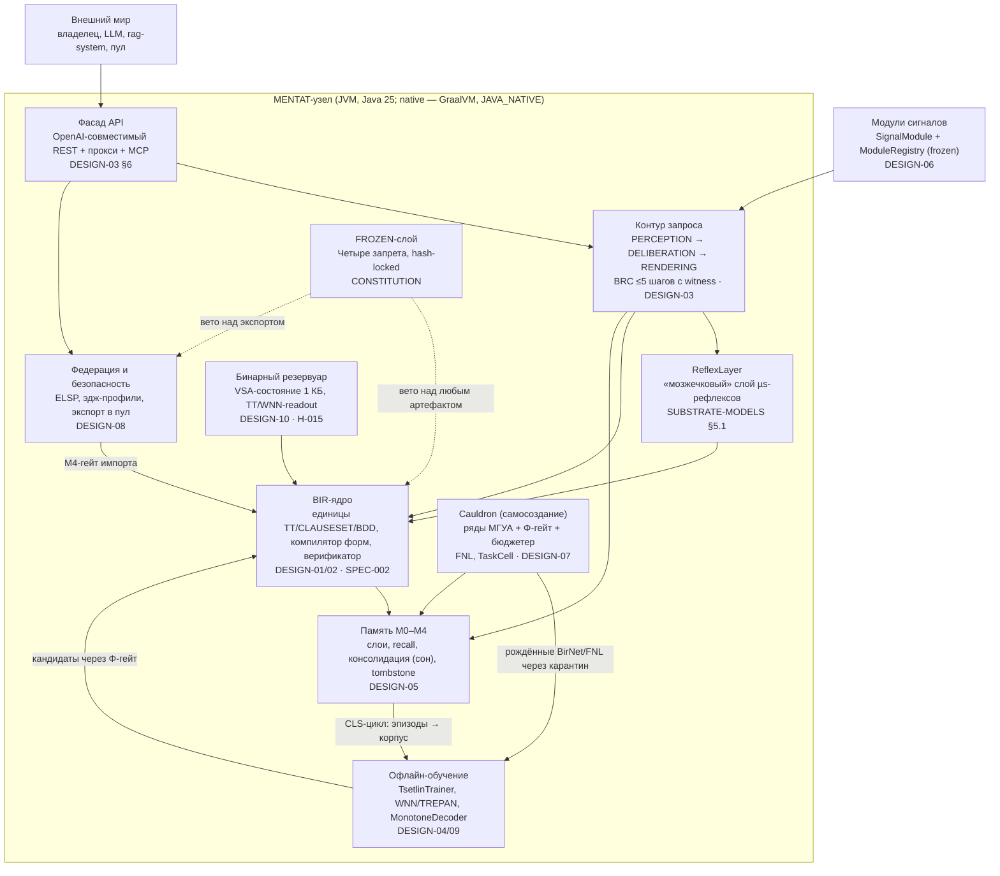
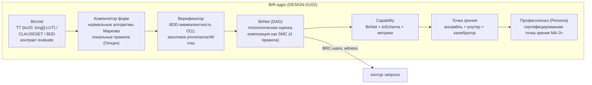
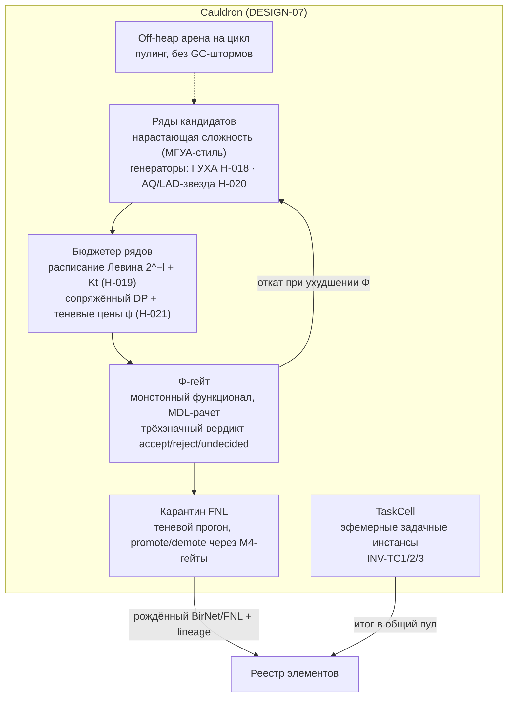
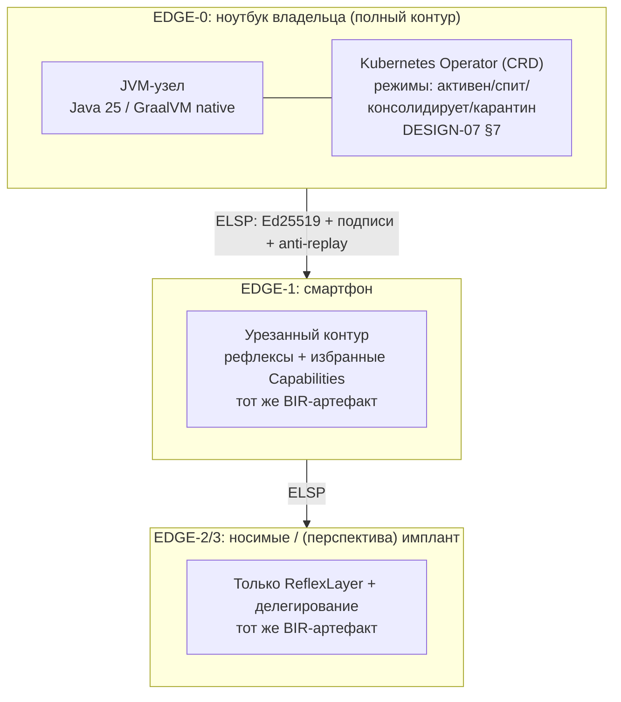

# C4-модель MATRIX/MENTAT

**Статус: living** · Архитектурные виды по модели C4 (Браун): контекст → контейнеры → компоненты → (код — DESIGN-01…10). Диаграммы — Mermaid (рендерятся на GitHub). Трассировка: каждый блок ссылается на дизайн-документ, требования (GOALS-REQUIREMENTS) и основание в атласе (SYSTEM-SYNTHESIS). При противоречии нормативны DESIGN-документы; этот файл — карта, не спека.

## Уровень 1. Контекст системы

```mermaid
flowchart TB
    owner["Владелец<br/>(человек, ноутбук/смартфон)"]
    teacher["TeacherOracle<br/>(человек-учитель в интерактивном обучении)"]
    mentat["MENTAT-узел<br/>локальный контур: восприятие → размышление → действие<br/>BIR-ядро, без GPU, без обязательного LLM"]
    rag["rag-system<br/>(внешняя зависимость, ADR-001)"]
    llm["Локальный LLM ≤3B<br/>(опциональный бэкенд сигналов и baseline экспериментов)"]
    pool["Noosphere-пул<br/>P2P-федерация узлов: gossip + CRDT + консенсус"]
    edge["Эдж-профили EDGE-1…3<br/>смартфон → носимые → (перспектива) имплант"]

    owner -->|запросы, golden-наборы, аудит| mentat
    teacher -->|уроки, подтверждения Φ-гейту| mentat
    mentat -->|контрактные запросы (изоляция по ADR-001)| rag
    mentat -->|медиа-линейки через SignalModule| llm
    mentat -->|обезличенный экспорт (k=100 + DP, opt-in)| pool
    pool -->|свежие нейроны через M4-гейт| mentat
    mentat -->|делегирование рефлексов| edge
```

Ключевые границы контекста:
- LLM — **опция, а не ядро** (G-B); все внешние зависимости изолированы контрактами (DESIGN-03 §5, ADR-001).
- Экспорт в пул — только обезличенный и opt-in (DESIGN-08 §4, H-013); персональные полезные данные узел не покидают (tombstone-политика, CONSTITUTION).
- Учитель — первоклассный участник: интерактивное обучение с подтверждением (DESIGN-04 §4, «три соединения» HWME, атлас §24).

## Уровень 2. Контейнеры узла



Замечания по контейнерам:
- **Все стрелки в core проходят верификатор**: артефакт без заголовка (provenance, fidelity, Φ, хэш) не исполняется (SPEC-002, FR-02).
- **FROZEN-слой — не контейнер, а сквозное вето** (пунктир): реализован как hash-locked BIR-артефакты + проверка в контуре (CONSTITUTION, Запреты 1–4).
- Cauldron и обучение работают только в офлайн-окнах и proactive-слотах — онлайн-контур не блокируется (DESIGN-07 §5, NFR-10).

## Уровень 3. Компоненты: BIR-ядро



Основания: TT-санкция — Мойсил (§26); каноничность BDD ≡ автоустойчивость (§8); изотропия CLAUSESET — Пирс (§31); композиция SMC — §2; локальность правил компилятора — Генцен (§33); wp-вывод сторожей — Дейкстра (§28).

## Уровень 3. Компоненты: Cauldron и гейты



Контур самонаблюдения (гомеостат, H-022) стоит над контейнерами: метрики (энергия/тик, покрытие, доля UNDECIDED, отказы гейтов) → коридоры → минимальная коррекция из версионируемого меню (перебалансировка бюджетов, понижение фрагмента); каждая коррекция — событие с witness (EXP-022).

## Уровень 4

Код-уровень не дублируется здесь: структуры данных, псевдокод, сложности, бюджеты и приёмочные тесты — в DESIGN-01…DESIGN-10 (порядок чтения — SYSTEM-SYNTHESIS §6). Правило: компонент на этой карте существует только если у него есть DESIGN-документ; новый компонент = новый DESIGN + ADR.

## Развёртывание



Один BIR-артефакт исполняется на всех профилях (FR-12, NFR-09); режимы узла — Statecharts (§13), инварианты INV-S1/S2 проверяются model checking'ом в CI (H-017).

## Соглашения диаграмм

- Сплошная стрелка — синхронный вызов/поток данных; пунктир — сквозное ограничение (вето, политика, бюджет).
- Каждый блок обязан трассироваться: DESIGN-документ → FR/NFR → (при наличии) гипотеза H-xxx и раздел атласа.
- Изменение топологии контейнеров — только через ADR (см. ADR-001…005) и обновление этого файла в том же коммите.
