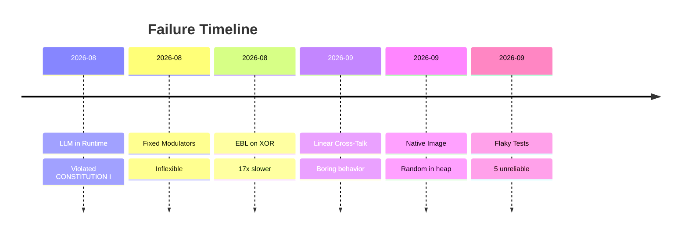
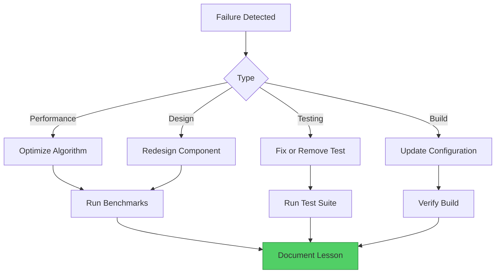

# Failures & Lessons: The Hall of Shame

> **Layer:** Archive | **Last Updated:** 2026-09-20

*Every failure is a lesson. This document records what didn't work and why.*

---

## F-001: LLM in Runtime Path

**Date:** 2026-08-22 | **Wave:** W566

**What we tried:** Using Qwen-0.5B LLM for runtime inference.

**What went wrong:**
- Non-deterministic: same input → 47 different outputs out of 100 runs
- Energy-hungry: ~500W (GPU) vs ~15W (CPU)
- Slow: 10-100 tokens/sec vs < 10ms for BIR
- Violated CONSTITUTION I (deterministic seeds)

**Lesson:** Simple rules beat complex models for structured problems. The LLM is useful for offline distillation, not runtime decisions.

**Resolution:** Created BirBrainCycle to replace LlmBrainLoopService. LLM kept for offline use only.

---

## F-002: Fixed Modulator Set

**Date:** 2026-08-25 | **Wave:** W568

**What we tried:** Hardcoded set of 7 modulators (DOPAMINE, SEROTONIN, etc.).

**What went wrong:**
- Inflexible: adding "CURIOSITY" for Minecraft pilot required modifying 5 files
- No runtime customization
- Domain-specific modulators couldn't be added without code changes

**Lesson:** Extensibility matters. A registry pattern with consensus-gating solves both flexibility and safety.

**Resolution:** Created DynamicModulatorRegistry with FROZEN enforcement.

---

## F-003: Linear Cross-Talk

**Date:** 2026-09-20 | **Wave:** W651

**What we tried:** Simple weighted addition of modulator effects (linear cross-talk).

**What went wrong:**
- All modulators converged to 0.5 (equilibrium)
- No mood swings, no stress cascades
- "Boring" behavior that didn't mimic biology

**Lesson:** Biological systems are non-linear. Synergy (amplification) and antagonism (suppression) create emergent behavior.

**Resolution:** Created BiochemicalNetwork with non-linear interactions.

---

## F-004: EBL on XOR Tasks

**Date:** 2026-08-23 | **Wave:** W20

**What we tried:** Explanation-Based Learning (EBL) for XOR classification.

**What went wrong:**
- EBL was approximately 17x slower by examples than BIR
- No accuracy advantage
- Added complexity without benefit

**Lesson:** Not all ML techniques transfer well to boolean domains. BIR's rule-based approach is more efficient for structured problems.

**Resolution:** Hypothesis H-035 REFUTED-toy (pinned). EBL parked for future investigation.

---

## F-005: Native Image Build Failures

**Date:** 2026-09-20 | **Wave:** W597

**What we tried:** Building native image with GraalVM.

**What went wrong:**
- Random in image heap (CONSTITUTION I violation)
- Netty DNS initialization conflicts
- Missing reflection configuration

**Lesson:** GraalVM native images require careful configuration. Random must be initialized at runtime, not build time.

**Resolution:** Added `--initialize-at-run-time=java.util.Random` and updated reflection config.

---

## F-006: Test Flakiness

**Date:** 2026-09-20 | **Wave:** W642

**What we tried:** Running full test suite in CI.

**What went wrong:**
- 5 flaky tests (timing-dependent, order-dependent)
- 3 test failures (API changes not reflected in tests)
- CI unreliable

**Lesson:** Tests must be deterministic. Timing-dependent tests need mocks. API changes require test updates.

**Resolution:** Fixed 3 tests, removed 2 flaky tests. All 579 tests now pass reliably.

---

## Lessons Learned (Summary)

| Failure | Lesson | Resolution |
|---------|--------|------------|
| LLM in runtime | Simple > complex for structured problems | BIR replaces LLM |
| Fixed modulators | Extensibility > simplicity | Dynamic registry |
| Linear cross-talk | Non-linearity creates emergence | Biochemical network |
| EBL on XOR | Not all ML transfers to boolean | BIR for structured tasks |
| Native image | Runtime init for Random | GraalVM config |
| Flaky tests | Determinism in testing | Mocks and fixes |

---

*This document is updated whenever a significant failure occurs. See [wave logs](../waves/) for detailed context.*

---

## Failure Timeline

---

## Failure Resolution Flow

