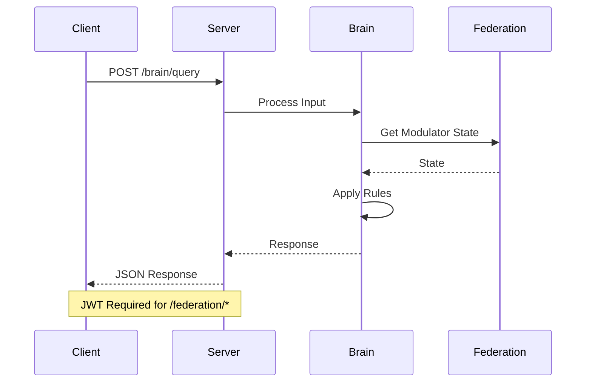

# API Reference

> **Layer:** Engineer | **Base URL:** `http://localhost:8080` | **Last Updated:** 2026-09-20

---

## Brain Endpoints

### POST /brain/query

Process a query through the brain cycle.

**Request:**
```json
{
  "input": "Is it ethical to lie?",
  "mode": "DEEP_UNDERSTANDING"
}
```

**Response:**
```json
{
  "output": "No",
  "confidence": 0.85,
  "reasoning": "ETHICAL_FILTER activated: deception detected",
  "mode": "DEEP_UNDERSTANDING",
  "latencyMs": 15,
  "modulators": {
    "DOPAMINE": 0.5,
    "CORTISOL": 0.3,
    "ETHICAL_FILTER": 1.0
  }
}
```

**curl Example:**
```bash
curl -X POST http://localhost:8080/brain/query \
  -H "Content-Type: application/json" \
  -d '{"input": "Is it ethical to lie?"}'
```

### GET /brain/status

Get current brain status.

**Response:**
```json
{
  "cycle": "BirBrainCycle",
  "activeNodes": 3,
  "mood": "NEUTRAL",
  "sleepNeed": 0.2
}
```

---

## Federation Endpoints

### GET /federation/nodes

List all federation nodes.

**Response:**
```json
{
  "nodes": [
    {"id": 1, "role": "GUARDIAN", "status": "ACTIVE"},
    {"id": 2, "role": "ADULT", "status": "ACTIVE"},
    {"id": 3, "role": "LEARNER", "status": "ACTIVE"}
  ]
}
```

### POST /federation/consensus

Create a consensus proposal.

**Request:**
```json
{
  "proposal": "Add new modulator CURIOSITY",
  "timeout": 10000
}
```

**Response:**
```json
{
  "proposalId": "prop-123",
  "status": "APPROVED",
  "votes": {"YES": 2, "NO": 1},
  "weight": {"YES": 1.5, "NO": 0.3}
}
```

---

## Modulator Endpoints

### GET /modulators

Get all modulator levels.

**Response:**
```json
{
  "modulators": {
    "DOPAMINE": {"level": 0.5, "sensitivity": 1.0},
    "SEROTONIN": {"level": 0.6, "sensitivity": 1.0},
    "CORTISOL": {"level": 0.2, "sensitivity": 1.0},
    "NOREPINEPHRINE": {"level": 0.3, "sensitivity": 1.0}
  }
}
```

### POST /modulators/inject

Inject a modulator level (operator intervention).

**Request:**
```json
{
  "modulatorId": "CORTISOL",
  "amount": 0.5,
  "reason": "Emergency stress test"
}
```

**Response:**
```json
{
  "success": true,
  "newLevel": 0.7,
  "mood": "STRESSED"
}
```

---

## Health Endpoints

### GET /health

Health check.

**Response:**
```json
{
  "status": "UP",
  "version": "5.0.0",
  "nodes": 3,
  "uptime": 3600
}
```

### GET /metrics

Prometheus metrics.

**Response:**
```
# HELP matrix_requests_total Total requests
# TYPE matrix_requests_total counter
matrix_requests_total 1234
```

---

## WebSocket Endpoints

### ws://localhost:8080/ws/telemetry

Real-time telemetry stream.

**Messages:**
```json
{
  "type": "MODULATOR_UPDATE",
  "data": {"DOPAMINE": 0.55, "CORTISOL": 0.25}
}
```

```json
{
  "type": "FEDERATION_EVENT",
  "data": {"event": "NODE_PROMOTED", "nodeId": 3, "newRole": "ADULT"}
}
```

---

## Error Responses

All errors follow this format:

```json
{
  "error": "INVALID_INPUT",
  "message": "Input cannot be empty",
  "code": 400
}
```

| Code | Error | Description |
|------|-------|-------------|
| 400 | INVALID_INPUT | Malformed request |
| 401 | UNAUTHORIZED | Missing authentication |
| 403 | FORBIDDEN | Insufficient capability |
| 404 | NOT_FOUND | Resource not found |
| 500 | INTERNAL_ERROR | Server error |

---

## Rate Limiting

| Endpoint | Limit | Window |
|----------|-------|--------|
| /brain/query | 100/min | per IP |
| /federation/* | 200/min | per IP |
| /modulators/inject | 10/min | per user |

---

## Authentication

JWT tokens required for protected endpoints.

```bash
# Get token
curl -X POST http://localhost:8080/auth/login \
  -d '{"username": "admin", "password": "secret"}'

# Use token
curl -H "Authorization: Bearer <token>" \
  http://localhost:8080/federation/nodes
```

---

## API Flow


