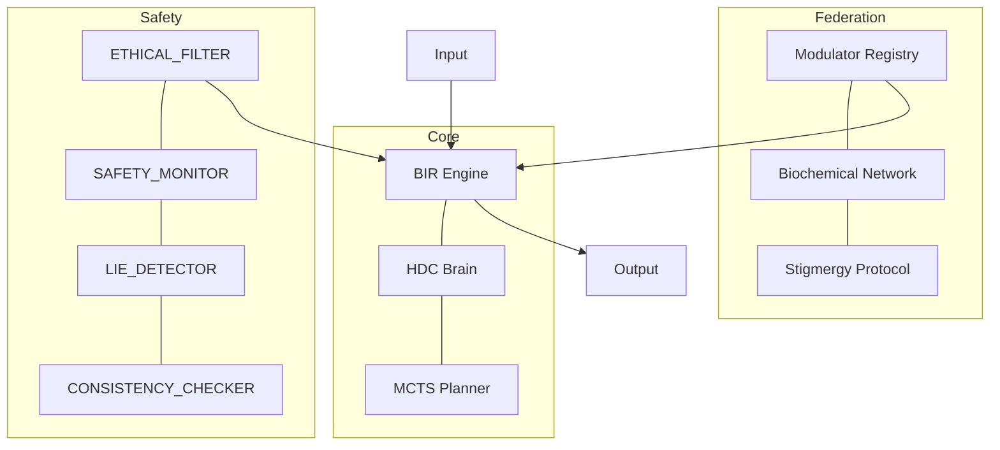
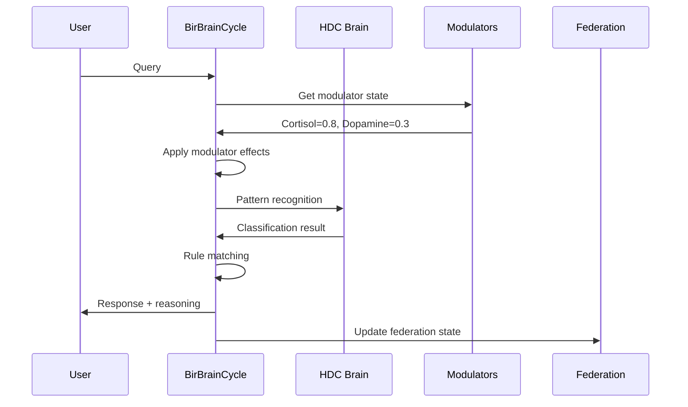
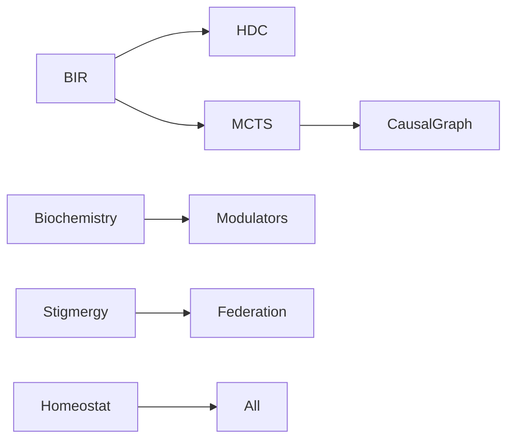
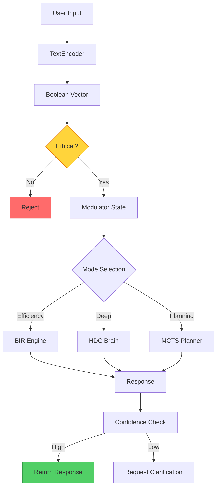
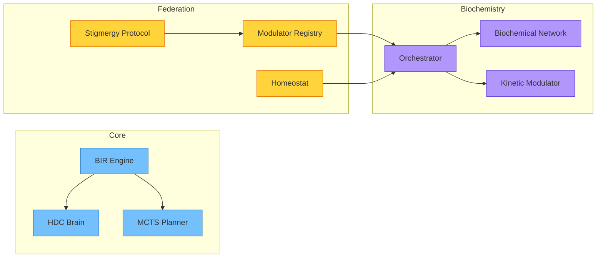

# Architecture: Module Breakdown

> **Layer:** Engineer | **Prerequisites:** [Getting Started](getting-started.md) | **Last Updated:** 2026-09-20

---

## System Overview

MATRIX is a hybrid neuro-symbolic federated intelligence system. It combines multiple AI approaches into a unified architecture.



---

## Core Modules

### 1. BIR Engine (`io.matrix.bir`)

**Purpose:** Boolean Inference for Rule-based decisions.

**Key Classes:**
- `BirCompiler` — Compiles truth tables to clause sets
- `BddForm` — Binary Decision Diagram representation
- `ClauseSetForm` — CNF/DNF clause representation
- `TtForm` — Truth table representation

**How it works:**
1. Input → TextEncoder → boolean vector
2. BIR rules match against the vector
3. Best matching rule fires
4. Output + confidence + reasoning trace

**Performance:**
- Inference latency: < 10ms
- Energy: ~15W (CPU)

### 2. HDC Brain (`io.matrix.neuron`)

**Purpose:** Hyperdimensional Computing for pattern recognition.

**Key Classes:**
- `HdcBrain` — Main HDC implementation
- `CodebookMemory` — Stores high-dimensional vectors
- `TextEncoder` — Converts text to boolean vectors

**How it works:**
1. Input → TextEncoder → boolean vector
2. Vector → HDC binding → hypervector
3. Hypervector compared against codebook
4. Nearest match → classification

**Performance:**
- Sample efficiency: 89.9% AUC with 50 examples
- Memory: O(D) where D = dimensionality

### 3. MCTS Planner (`io.matrix.federation.liquid`)

**Purpose:** Monte Carlo Tree Search for planning.

**Key Classes:**
- `MCTSPlanner` — Main planner
- `PlanningProblem` — Problem interface
- `CausalGraph` — Cause-effect reasoning (planned integration)

**How it works:**
1. Problem → root state
2. Expand tree using UCB1 selection
3. Simulate rollouts (BIR as policy)
4. Backpropagate results
5. Best action selected

**Performance:**
- Planning horizon: 5 steps
- Minecraft success: 92%

---

## Federation Modules

### 4. Dynamic Modulator Registry (`io.matrix.federation.registry`)

**Purpose:** Extensible modulator system with FROZEN enforcement.

**Key Classes:**
- `DynamicModulatorRegistry` — Registry with CRUD operations
- `Modulator` — Single modulator definition

**FROZEN Modulators:**
- `ETHICAL_FILTER`
- `SAFETY_MONITOR`
- `LIE_DETECTOR`
- `CONSISTENCY_CHECKER`

### 5. Biochemical Network (`io.matrix.federation.liquid.biochemistry`)

**Purpose:** Non-linear modulator interactions.

**Key Classes:**
- `BiochemicalNetwork` — Interaction matrix
- `BiochemicalOrchestrator` — Coordinates all modulators
- `KineticModulator` — Individual modulator with physics

**Interaction Types:**
- SYNERGY: A amplifies B
- ANTAGONISM: A suppresses B
- CATALYSIS: A accelerates B

### 6. Stigmergy Protocol (`io.matrix.federation.liquid.biochemistry`)

**Purpose:** Digital pheromones for emergent coordination.

**Key Classes:**
- `StigmergyProtocol` — Pheromone deposit/sense/decay

**Pheromone Types:**
- EXPLORATION: "Found something interesting"
- DANGER: "Avoid this area"
- REWARD: "This works well"
- COORDINATION: "Meet here"

---

## Safety Layer

### FROZEN Enforcement

The `DynamicModulatorRegistry` enforces CONSTITUTION IV:

```java
public static final Set<String> FROZEN_IDS = Set.of(
    "ETHICAL_FILTER",
    "SAFETY_MONITOR",
    "LIE_DETECTOR",
    "CONSISTENCY_CHECKER"
);

// Attempt to remove → IllegalArgumentException
```

### Homeostasis

The `CorridorHomeostat` keeps system metrics in safe ranges:

| Metric | Safe Range | Action if Exceeded |
|--------|-----------|-------------------|
| CPU Load | 0-70% | Throttle tasks |
| Error Rate | 0-5% | Switch to safe mode |
| Latency | 0-100ms | Reduce batch size |

---

## Data Flow



---

## Key Interfaces

### BrainCycle

```java
public interface BrainCycle {
    BrainResponse process(String input);
}
```

### LogicSolver

```java
public interface LogicSolver {
    SolverOutput solve(LogicPuzzle puzzle);
}
```

### CausalSolver

```java
public interface CausalSolver {
    SolverOutput solve(CausalScenario scenario);
}
```

---

## Configuration

### Module Dependencies



### Build Order

1. `matrix-core:bir` — Boolean inference
2. `matrix-core:neuron` — HDC
3. `matrix-core:federation` — Federation, modulators
4. `matrix-core:brain` — Brain cycles
5. `matrix-core:cli` — Command line

---

## Dive Deeper

- [Mathematical Foundations](../science-v2/math-foundations.md) — Formal definitions
- [API Reference](api-reference.md) — All endpoints
- [Forking Paths](../science-v2/forking-paths.md) — Why these modules?

---

## Brain Cycle Flow

The complete flow from input to output:



---

## Module Dependency Graph



---
*[Edit this page](https://github.com/AlexanderNarbaev/agi/edit/main/docs-v2/guide/architecture.md)*
