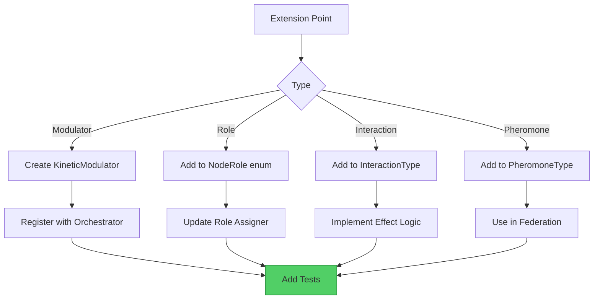

# Extending MATRIX

> **Layer:** Engineer | **Prerequisites:** [Architecture](architecture.md) | **Last Updated:** 2026-09-20

---

## Adding a New Modulator

### Step 1: Define the Modulator

```java
// Create a new modulator with initial values
KineticModulator curiosity = new KineticModulator(
    "CURIOSITY",       // id
    "Curiosity",       // name
    0.1,               // productionRate
    0.05,              // decayRate
    0,                 // minLevel
    1,                 // maxLevel
    0.5,               // initialLevel
    1.0,               // receptorSensitivity
    0.01,              // adaptationRate
    false              // frozen (not FROZEN)
);
```

### Step 2: Register with Orchestrator

```java
BiochemicalOrchestrator orchestrator = BiochemicalOrchestrator.createDefault();
orchestrator.registerModulator(curiosity);
```

### Step 3: Define Interactions

```java
BiochemicalNetwork network = orchestrator.getNetwork();

// Curiosity amplifies Dopamine (exploration reward)
network.addInteraction(new BiochemicalNetwork.Interaction(
    "CURIOSITY", "DOPAMINE",
    BiochemicalNetwork.InteractionType.SYNERGY,
    0.4,   // weight
    0.5    // nonLinearity
));

// Cortisol suppresses Curiosity (stress kills exploration)
network.addInteraction(new BiochemicalNetwork.Interaction(
    "CORTISOL", "CURIOSITY",
    BiochemicalNetwork.InteractionType.ANTAGONISM,
    0.6,   // weight
    0.7    // nonLinearity
));
```

### Step 4: Add Tests

```java
@Test
void testCuriosityModulator() {
    BiochemicalOrchestrator orchestrator = BiochemicalOrchestrator.createDefault();
    orchestrator.registerModulator(new KineticModulator(
        "CURIOSITY", "Curiosity", 0.1, 0.05, 0, 1, 0.5, 1.0, 0.01, false));

    // Verify it exists
    assertNotNull(orchestrator.getModulator("CURIOSITY"));

    // Verify interactions
    orchestrator.tick(1.0);
    double level = orchestrator.getModulator("CURIOSITY").getCurrentLevel();
    assertTrue(level >= 0 && level <= 1);
}
```

---

## Adding a New Node Role

### Step 1: Define the Role

```java
// In NodeRole.java, add a new enum value
public enum NodeRole {
    INFANT,
    LEARNER,
    ADULT,
    SPECIALIST,
    GUARDIAN,
    RESEARCHER  // New role
}
```

### Step 2: Update Role Assigner

```java
// In LiquidNodeRoleAssigner.java, add promotion criteria
case RESEARCHER:
    // Promote from SPECIALIST when accuracy > 0.95 for 100+ tasks
    return metrics.getAccuracy() > 0.95 && metrics.getTaskCount() > 100;
```

### Step 3: Update Consensus Weights

```java
// In CapabilityConsensusEngine.java, add voting weight
case RESEARCHER:
    return 0.9; // High weight, just below GUARDIAN
```

### Step 4: Add Tests

```java
@Test
void testResearcherRole() {
    LiquidNodeRoleAssigner assigner = new LiquidNodeRoleAssigner();
    assigner.registerNode(1);
    assigner.forceTransition(1, NodeRole.RESEARCHER, "test");

    assertEquals(NodeRole.RESEARCHER, assigner.getRole(1));
}
```

---

## Adding a New Interaction Type

### Step 1: Define the Type

```java
// In BiochemicalNetwork.InteractionType
public enum InteractionType {
    SYNERGY,
    ANTAGONISM,
    CATALYSIS,
    INHIBITION,  // New type
    NONE
}
```

### Step 2: Implement the Effect

```java
// In BiochemicalNetwork.computeSingleEffect()
case INHIBITION -> {
    // Complete suppression when source is high
    double threshold = 0.7;
    if (sourceLevel > threshold) {
        yield -targetLevel; // Suppress to zero
    }
    yield 0;
}
```

### Step 3: Add Tests

```java
@Test
void testInhibitionInteraction() {
    BiochemicalNetwork network = new BiochemicalNetwork();
    network.addInteraction(new BiochemicalNetwork.Interaction(
        "A", "B", BiochemicalNetwork.InteractionType.INHIBITION, 1.0, 0.0));

    // Low source: no effect
    var low = network.computeInteractionEffects(
        new BiochemicalNetwork.ModulatorSnapshot(Map.of("A", 0.5, "B", 0.5)));
    assertEquals(0, low.get("B"), 0.01);

    // High source: complete suppression
    var high = network.computeInteractionEffects(
        new BiochemicalNetwork.ModulatorSnapshot(Map.of("A", 0.9, "B", 0.5)));
    assertEquals(-0.5, high.get("B"), 0.01);
}
```

---

## Adding a New Pheromone Type

### Step 1: Define the Type

```java
// In StigmergyProtocol.PheromoneType
public enum PheromoneType {
    EXPLORATION,
    DANGER,
    REWARD,
    COORDINATION,
    CONSENSUS  // New type
}
```

### Step 2: Use in Federation

```java
// When consensus is reached, deposit pheromone
stigmergy.deposit(nodeId, "consensus-topic",
    StigmergyProtocol.PheromoneType.CONSENSUS,
    0.9, // strength
    Map.of("proposalId", proposalId));
```

---

## Adding a New Brain Cycle

### Step 1: Implement the Interface

```java
public class MyBrainCycle implements BrainCycle {
    @Override
    public BrainResponse process(String input) {
        // Your custom logic here
        return new BrainResponse(output, confidence, reasoning, mode, modulators);
    }
}
```

### Step 2: Register with Server

```java
// In BrainHttpServer.java
BrainCycle cycle = new MyBrainCycle();
server.setBrainCycle(cycle);
```

### Step 3: Add Tests

```java
@Test
void testMyBrainCycle() {
    MyBrainCycle cycle = new MyBrainCycle();
    BrainResponse response = cycle.process("test input");
    assertNotNull(response);
    assertTrue(response.confidence() > 0);
}
```

---

## Best Practices

1. **Always add tests** — Every new component needs at least 3 tests
2. **Use property tests** — For invariants that must hold for any input
3. **Document interactions** — New modulators need interaction documentation
4. **Check CONSTITUTION** — Ensure no violations of the Four Laws
5. **Update SUMMARY.md** — Add new modules to the table of contents

---

## Extension Points



---
*[Edit this page](https://github.com/AlexanderNarbaev/agi/edit/main/docs-v2/guide/extending.md)*
