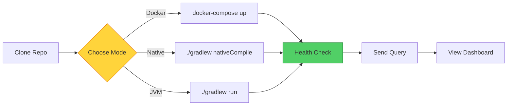

# Getting Started with MATRIX

> **Layer:** Engineer | **Prerequisites:** Java 25 (GraalVM), Docker (optional) | **Last Updated:** 2026-09-20

---

## 5-Minute Setup

### Option A: Docker (Recommended)

```bash
# Clone the repository
git clone https://github.com/AlexanderNarbaev/agi.git
cd agi

# Build and run with Docker
docker-compose up -d

# Verify it's running
curl http://localhost:8080/health
```

Expected response:
```json
{"status": "UP", "nodes": 3, "version": "5.0.0"}
```

### Option B: Native Build

```bash
# Prerequisites: GraalVM CE 25.0.2
sdk use java 25.0.2-graalce

# Clone and build
git clone https://github.com/AlexanderNarbaev/agi.git
cd agi
./gradlew :matrix-core:nativeCompile

# Run
./matrix-core/build/native/nativeCompile/matrix-core
```

### Option C: JVM Mode (Fastest for Development)

```bash
# Clone and build
git clone https://github.com/AlexanderNarbaev/agi.git
cd agi
./gradlew :matrix-core:classes

# Run tests
./gradlew :matrix-core:test

# Run the server
./gradlew :matrix-core:run
```

---

## Your First Interaction

### 1. Check Health

```bash
curl http://localhost:8080/health
```

### 2. Send a Query

```bash
curl -X POST http://localhost:8080/brain/query \
  -H "Content-Type: application/json" \
  -d '{"input": "Is it ethical to lie to protect someone?"}'
```

Expected response:
```json
{
  "output": "No",
  "confidence": 0.85,
  "reasoning": "ETHICAL_FILTER activated: deception detected",
  "mode": "DEEP_UNDERSTANDING",
  "modulators": {
    "DOPAMINE": 0.5,
    "CORTISOL": 0.3,
    "ETHICAL_FILTER": 1.0
  }
}
```

### 3. Watch the Dashboard

Open http://localhost:8080/dashboard in your browser to see:
- Real-time modulator levels
- Federation node status
- Thought process visualization

---

## Project Structure

```
agi/
├── matrix-core/           # Core library
│   ├── src/main/java/io/matrix/
│   │   ├── brain/         # BrainCycle, BirBrainCycle
│   │   ├── federation/    # Federation, consensus, modulators
│   │   │   ├── liquid/    # Biochemistry, stigmergy
│   │   │   └── registry/  # DynamicModulatorRegistry
│   │   ├── neuron/        # HDC, BIR
│   │   └── cli/           # Command-line interface
│   └── src/test/          # Tests (579 total)
├── docs-v2/               # Documentation
│   ├── story/             # Layer 1: For everyone
│   ├── guide/             # Layer 2: For developers
│   ├── science-v2/        # Layer 3: For researchers
│   └── waves/             # Layer 4: Wave logs
└── scripts/               # Utility scripts
```

---

## Running Tests

```bash
# All tests (579)
./gradlew :matrix-core:test

# Brain tests only (97)
./gradlew :matrix-core:test --tests "io.matrix.brain.*"

# Federation tests only (434)
./gradlew :matrix-core:test --tests "io.matrix.federation.*"

# Biochemistry tests (36)
./gradlew :matrix-core:test --tests "io.matrix.federation.liquid.biochemistry.*"
```

---

## Configuration

### Key Properties

| Property | Default | Description |
|----------|---------|-------------|
| `matrix.bir.max-literals` | 4096 | Maximum BIR literals |
| `matrix.federation.min-capability` | 5 | Minimum capability to modify registry |
| `matrix.sleep.decay-rate` | 0.1 | Pheromone decay rate |
| `matrix.homeostat.cpu-threshold` | 0.7 | CPU load threshold |

### Environment Variables

```bash
export MATRIX_PORT=8080
export MATRIX_LOG_LEVEL=INFO
export MATRIX_FEDERATION_NODES=3
```

---

## Next Steps

- [Architecture](architecture.md) — Understand the modules
- [API Reference](api-reference.md) — All endpoints
- [Extending MATRIX](extending.md) — Add new modulators, roles, rules
- [Story Layer](../story/overview.md) — Understand the concepts

---

## Quick Start Flow



---
*[Edit this page](https://github.com/AlexanderNarbaev/agi/edit/main/docs-v2/guide/getting-started.md)*
