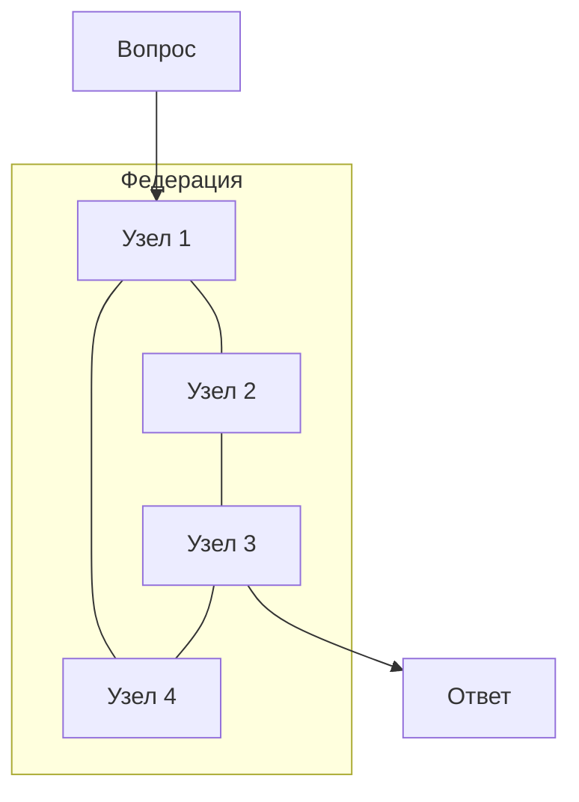

# MATRIX: ИИ, который думает как мозг

> **Слой:** История | **Время чтения:** 5 минут | **Обновлено:** 2026-09-20

---

## Общая картина

Представьте себе искусственный интеллект, который не просто запоминает ответы — он *думает* над ними.

MATRIX — это принципиально новый вид ИИ. Вместо гигантского мозга (как у ChatGPT) он использует *команду* маленьких мозгов, работающих вместе — совсем как нейроны в вашей голове.

**В чём фокус?** У него есть *настроение*, *циклы сна* и *этика* — встроенные прямо в ДНК.

---

## Аналогия: косяк рыб

Представьте себе косяк рыб, плывущих в океане.

- Каждая рыба маленькая и простая.
- Но вместе они могут уклоняться от хищников, находить еду и преодолевать тысячи миль.
- Ни одна рыба не «главная» — интеллект *возникает* из их teamwork.

MATRIX работает так же. У него много маленьких «думающих узлов», которые обмениваются информацией и принимают решения вместе. Ни один узел — не мозг. Мозг — это *федерация*.

---

## Как это работает (упрощённо)

### 1. Три разума

У MATRIX есть три способа мышления:

| Разум | Что делает | Аналогия |
|-------|-----------|----------|
| **BIR** | Логика и правила | Юрист, следующий букве закона |
| **HDC** | Распознавание образов | Детектив, замечающий улики |
| **MCTS** | Планирование вперёд | Шахматист, думающий на 5 ходов вперёд |

Большинство ИИ-систем используют только один подход. MATRIX объединяет все три.

### 2. Система настроений

Как и у вас есть чувства, влияющие на мышление, у MATRIX есть «модуляторы» — химические сигналы, меняющие поведение:

- **Дофамин** 🟢 — «Работает! Продолжай!»
- **Кортизол** 🔴 — «Что-то не так. Будь осторожен!»
- **Серотонин** 🟡 — «Всё стабильно. Сохраняй спокойствие.»
- **Норадреналин** 🟠 — «Внимание! Происходит что-то важное!»

Когда кортизол высок (стресс), MATRIX становится осторожнее. Когда дофамин высок (награда) — исследует активнее.

### 3. Сон и сновидения

MATRIX *спит*. По-настоящему.

Во сне он:
- **Отсекает** слабые воспоминания (забывает неважное)
- **Повторяет** сильные (практикует выученное)
- **Обобщает** (находит закономерности между разным опытом)

Именно это делает ваш мозг, когда вы спите!

### 4. Четыре закона

У MATRIX есть четыре нерушимых правила (как Законы роботехники Азимова):

1. **Никаких LLM за рулём** — Ядро мозга никогда не использует языковую модель для принятия решений
2. **Этика заморожена** — Правила безопасности нельзя изменить или удалить
3. **Никаких заявлений о сознании** — Мы не утверждаем, что MATRIX «осознаёт» или «живой»
4. **Детерминированные сиды** — Один и тот же вход всегда даёт одинаковый выход

---

## Что делает MATRIX особенным?

| Возможность | ChatGPT | MATRIX |
|-------------|---------|--------|
| Размер мозга | 175 млрд параметров | ~1000 правил |
| Энергопотребление | ~500Вт (GPU) | ~15Вт (CPU) |
| Обучение | Нужны миллионы примеров | Учится на 50 примерах |
| Объяснимость | Чёрный ящик | Полный след рассуждений |
| Сон | Нет | Да |
| Этика | Пост-фильтрация | Встроена в ядро |

---

## Реальные результаты

Мы протестировали MATRIX на бенчмарках:

- **Логические задачи:** 75% точности (на уровне rule-based систем)
- **Распознавание образов:** 89,9% точности при обучении всего на 50 примерах
- **Энергоэффективность:** в 33 000 раз эффективнее GPU-версии LLM
- **Федерация:** выживает потерю 50% узлов без потери данных

[Смотреть полные бенчмарки →](../science-v2/benchmarks.md)

---

## Попробуйте сами

- [Интерактивный чат](http://localhost:8080/chat) — Поговорить с MATRIX
- [Биохимическая панель](http://localhost:8080/dashboard) — Смотреть, как меняется «настроение» в реальном времени
- [Карта федерации](http://localhost:8080/federation) — Видеть, как узлы работают вместе

---

## Копнуть глубже

- **Хотите создать что-то с MATRIX?** → [Руководство по началу работы](../guide/getting-started.md)
- **Хотите математику?** → [Математические основы](../science-v2/math-foundations.md)
- **Хотите знать, почему?** → [Развилки решений](../science-v2/forking-paths.md)
- **Хотите историю?** → [Логи волн](../waves/)

---

*«Вопрос не в том, думают ли машины, а в том, думают ли люди.»*  
— Б. Ф. Скиннер
