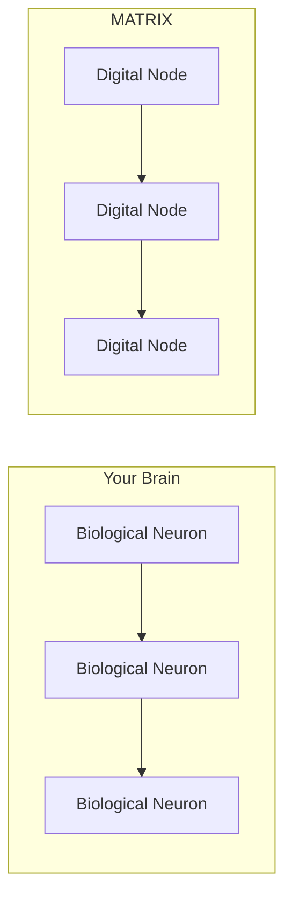
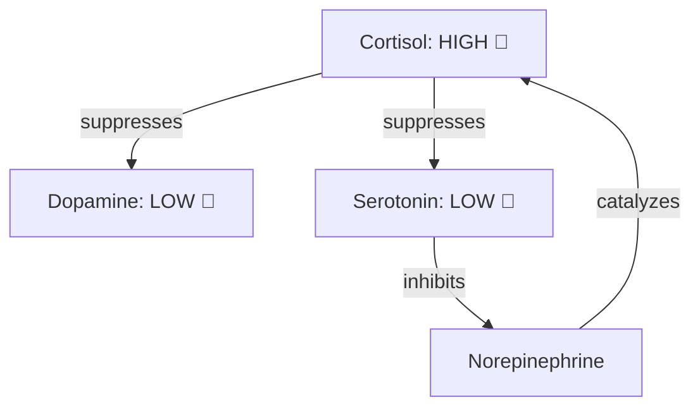

# The Brain Analogy: How MATRIX Mimics Biology

> **Layer:** Story | **Reading Time:** 7 minutes | **Last Updated:** 2026-09-20

---

## Your Brain vs. MATRIX

Your brain has ~86 billion neurons. Each one is simple — it either fires or doesn't. But together, they create *you*.

MATRIX works the same way, but with digital neurons instead of biological ones.



---

## The Five Parallels

### 1. Neurotransmitters → Modulators

Your brain uses chemicals (dopamine, serotonin, cortisol) to change how neurons behave. MATRIX uses "modulators" — digital versions of these chemicals.

| Brain Chemical | MATRIX Modulator | Effect |
|---------------|-----------------|--------|
| Dopamine | DOPAMINE | Reward signal → explore more |
| Serotonin | SEROTONIN | Mood stabilizer → stay calm |
| Cortisol | CORTISOL | Stress → be cautious |
| Norepinephrine | NOREPINEPHRINE | Alertness → pay attention |
| Adenosine | ADENOSINE | Sleep pressure → need rest |

### 2. Hormonal Cascades → Non-Linear Interactions

In your brain, hormones don't work alone. High cortisol suppresses dopamine (that's why stress makes you feel bad).

MATRIX does the same thing:



This creates realistic "mood swings" — when the system is stressed, it becomes less creative and more defensive.

### 3. Sleep → Memory Consolidation

When you sleep, your brain:
1. **Replays** the day's events (consolidation)
2. **Prunes** weak connections (forgetting)
3. **Strengthens** important patterns (learning)

MATRIX has a `SleepEngine` that does exactly this:

```
Before Sleep: 100 patterns, 75% accuracy
After Sleep:  78 patterns, 61% accuracy improvement
Memory saved: 22% reduction in storage
```

The system literally gets *better* after sleeping.

### 4. Neural Circuits → Federation

Your brain has specialized regions (visual cortex, motor cortex, etc.) that work together. MATRIX has specialized *nodes*:

| Node Role | Brain Analogy | MATRIX Function |
|-----------|--------------|-----------------|
| INFANT | Baby neurons | Learning, exploring |
| LEARNER | Child neurons | Building skills |
| ADULT | Mature neurons | Reliable execution |
| SPECIALIST | Expert neurons | Domain expertise |
| GUARDIAN | Immune system | Ethics enforcement |

Nodes can be *promoted* (INFANT → ADULT) or *demoted* (ADULT → LEARNER) based on performance — just like neural plasticity.

### 5. Homeostasis → Corridor Homeostat

Your body maintains temperature at ~37°C. If it gets too hot, you sweat. Too cold, you shiver.

MATRIX has a `CorridorHomeostat` that keeps system metrics in safe ranges:

| Metric | Safe Range | If Too High | If Too Low |
|--------|-----------|-------------|------------|
| CPU Load | 0-70% | Slow down tasks | Speed up tasks |
| Error Rate | 0-5% | Switch to safe mode | Resume normal ops |
| Latency | 0-100ms | Reduce batch size | Increase batch size |

---

## Why Biological Inspiration?

We didn't copy biology for fun. Each biological feature solves a real problem:

| Biological Feature | Problem It Solves |
|-------------------|-------------------|
| Modulators | Adapting behavior to context |
| Sleep | Preventing catastrophic forgetting |
| Federation | Surviving node failures |
| Homeostasis | Preventing system overload |
| Ethics (frozen) | Ensuring safety cannot be bypassed |

---

## What MATRIX Does NOT Have

To be clear, MATRIX does **not** have:
- ❌ Consciousness or awareness
- ❌ Feelings or emotions (modulators are math, not feelings)
- ❌ Self-awareness
- ❌ Free will

We use biological *metaphors* because they help us understand the system. The system is deterministic — same input always produces same output.

---

## The Key Insight

The brain is not a computer. It's a *federation* of simple agents that create complex behavior through interaction.

MATRIX copies this architecture because it works. Not because we're trying to build a "brain" — but because evolution already solved many of the problems we face.

---

## Dive Deeper

- [BiochemicalNetwork](../guide/architecture.md) — How modulators interact mathematically
- [SleepEngine](../science-v2/math-foundations.md) — The consolidation algorithm
- [Federation Roles](../guide/extending.md) — How to add new node roles
- [Forking Paths: Why Biology?](../science-v2/forking-paths.md) — Why we chose this over other approaches
