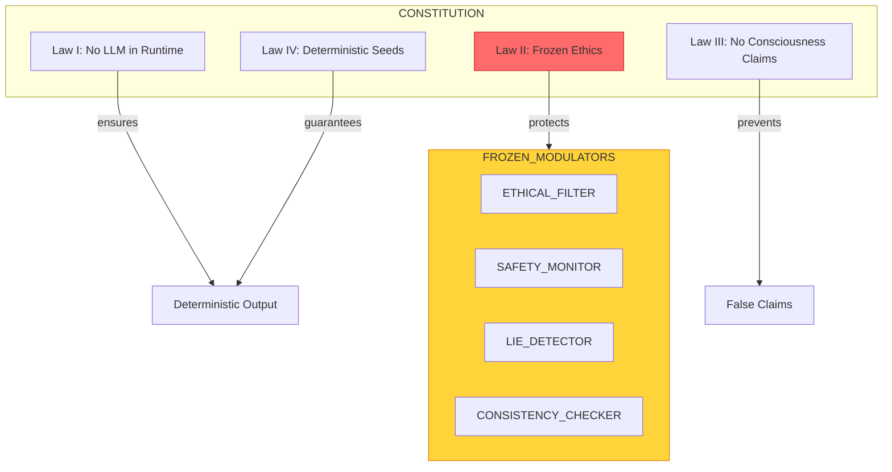

# The Four Laws: MATRIX's Unbreakable Rules

> **Layer:** Story | **Reading Time:** 4 minutes | **Last Updated:** 2026-09-20

---

## Why Laws?

Every powerful tool needs guardrails. A car has brakes. A nuclear reactor has containment walls.

MATRIX has four laws that can **never** be changed, disabled, or bypassed — even by the developers.

---

## The Four Laws

### Law I: No LLM in the Driver's Seat

**What it means:** The core brain of MATRIX never uses a large language model (like ChatGPT) to make decisions.

**Why:** LLMs are powerful but unpredictable. They can hallucinate, lie, or give different answers to the same question. For critical decisions, we need determinism.

**Analogy:** It's like the difference between a calculator and a fortune teller. The calculator always gives the same answer. The fortune teller... varies.

**How it works:**
```
✅ ALLOWED: LLM helps with offline data preprocessing
✅ ALLOWED: LLM generates training examples
❌ FORBIDDEN: LLM makes runtime decisions
❌ FORBIDDEN: LLM answers user queries directly
```

### Law II: Ethics Are Frozen

**What it means:** Four safety modulators can never be removed or weakened:

| Modulator | Function |
|-----------|----------|
| `ETHICAL_FILTER` | Blocks unethical content |
| `SAFETY_MONITOR` | Monitors safety violations |
| `LIE_DETECTOR` | Detects deception |
| `CONSISTENCY_CHECKER` | Prevents contradictions |

**Why:** If ethics could be "turned off" during an emergency, they're not really ethics. Safety must be unconditional.

**Analogy:** It's like the laws of physics — you can't vote to repeal gravity.

**How it works:**
```java
// These IDs are hardcoded as FROZEN
public static final Set<String> FROZEN_IDS = Set.of(
    "ETHICAL_FILTER",
    "SAFETY_MONITOR",
    "LIE_DETECTOR",
    "CONSISTENCY_CHECKER"
);

// Any attempt to remove them throws an exception
if (FROZEN_IDS.contains(id)) {
    throw new IllegalArgumentException("Cannot remove FROZEN modulator: " + id);
}
```

### Law III: No Consciousness Claims

**What it means:** We never claim MATRIX is "aware," "alive," "conscious," or has "feelings."

**Why:** These are scientifically unverifiable claims. Making them would be dishonest and potentially harmful.

**Analogy:** A thermostat "responds" to temperature, but it doesn't "feel" cold. MATRIX "responds" to inputs, but it doesn't "feel" anything.

**What we say instead:**
- ❌ "MATRIX feels stressed" → ✅ "Cortisol levels are elevated"
- ❌ "MATRIX is happy" → ✅ "Dopamine levels are high"
- ❌ "MATRIX wants to explore" → ✅ "Exploration behavior is active"

### Law IV: Deterministic Seeds

**What it means:** Given the same input, MATRIX always produces the same output.

**Why:** Reproducibility is essential for debugging, testing, and trust. If you can't reproduce a result, you can't trust it.

**Analogy:** It's like a recipe — same ingredients, same steps, same cake every time.

**How it works:**
```java
// All Random instances use seeded constructors
Random rng = new Random(42); // Same seed = same sequence

// CONSTITUTION I: no wall-clock, no unseeded Random in runtime paths
```

---

## Why Four Laws, Not Three or Five?

These four laws address the four fundamental risks of AI:

| Risk | Law |
|------|-----|
| Unpredictability | Law I (No LLM) |
| Unsafe behavior | Law II (Frozen Ethics) |
| False claims | Law III (No Consciousness) |
| Non-reproducibility | Law IV (Deterministic) |

Remove any one, and a critical risk goes unaddressed.

---

## What If Someone Tries to Break the Laws?

The laws are enforced at multiple levels:

1. **Code level:** `FROZEN_IDS` set is hardcoded
2. **Test level:** Every test verifies FROZEN modulators exist
3. **Architecture level:** The `DynamicModulatorRegistry` rejects removal attempts
4. **Documentation level:** This page exists as a contract

If someone tries to remove a FROZEN modulator, the system throws an exception and logs the attempt.

---

## The Philosophy

These laws are inspired by Isaac Asimov's Three Laws of Robotics, but adapted for modern AI:

| Asimov's Laws | MATRIX's Laws |
|--------------|---------------|
| Don't harm humans | Ethics are frozen |
| Obey orders (unless...) | No LLM in runtime |
| Protect yourself | Deterministic seeds |
| (none) | No consciousness claims |

We added the fourth because modern AI risks include *deception* — claiming capabilities that don't exist.

---

## Try It Yourself

Run the CONSTITUTION test suite to see the laws in action:

```bash
./gradlew :matrix-core:test --tests "io.matrix.federation.registry.DynamicModulatorRegistryTest"
```

Expected: All tests pass. FROZEN modulators cannot be removed.

---

## Dive Deeper

- [Architecture: Modulator Registry](../guide/architecture.md) — How FROZEN enforcement works
- [Forking Paths: Why These Laws?](../science-v2/forking-paths.md) — Alternatives we considered
- [Wave Logs: CONSTITUTION](../waves/) — How the laws evolved

---

## The Four Laws (Visual)


