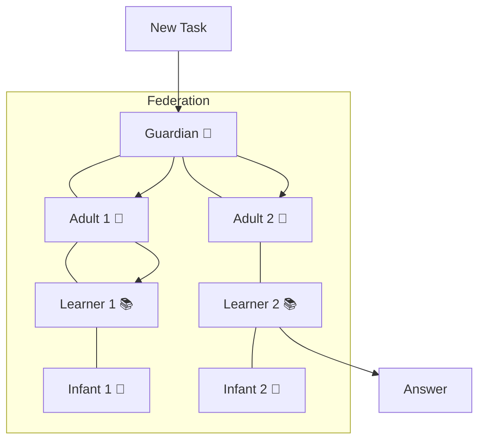
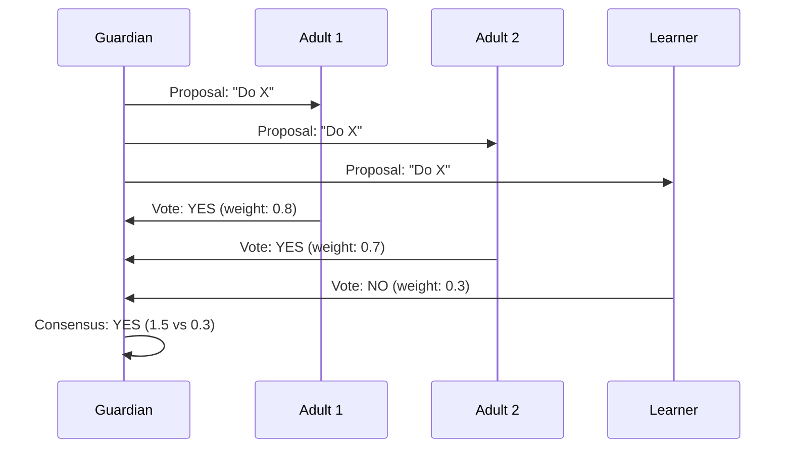
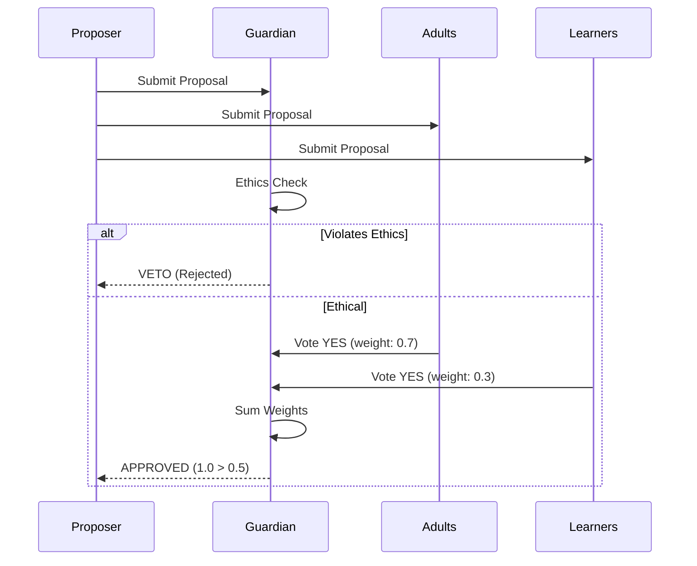

# The Digital Hive Mind: How Nodes Work Together

> **Layer:** Story | **Reading Time:** 6 minutes | **Last Updated:** 2026-09-20

---

## The Hive Mind Concept

A single bee is not very smart. It can fly, find flowers, and sting. But a beehive? It builds complex structures, regulates temperature, and defends against predators.

MATRIX works the same way. Each "node" is a small thinking unit. Together, they form a *federation* — a digital hive mind.



---

## The Five Roles

Every node has a role, just like every bee has a job:

| Role | Symbol | Job | Can Be Promoted? |
|------|--------|-----|------------------|
| **INFANT** | 🍼 | Learning, exploring | → LEARNER |
| **LEARNER** | 📚 | Building skills | → ADULT |
| **ADULT** | 🧠 | Reliable execution | → SPECIALIST |
| **SPECIALIST** | 🎯 | Domain expertise | → GUARDIAN |
| **GUARDIAN** | 👑 | Ethics enforcement | Cannot be demoted |

### How Promotion Works

Nodes earn promotions by performing well:

```
INFANT performs well → metrics improve → auto-promoted to LEARNER
LEARNER performs well → metrics improve → auto-promoted to ADULT
```

And demotions work too:

```
ADULT performs poorly → metrics degrade → demoted to LEARNER
```

This is like neural plasticity — your brain strengthens useful connections and weakens useless ones.

---

## How Nodes Make Decisions

### Capability Consensus

When a decision needs to be made, nodes vote. But not all votes are equal — more capable nodes get more weight:



### Guardian Veto

Guardians have a special power: they can *veto* any decision that violates ethics.

```
Proposal: "Skip safety check to save time"
Adults: YES (faster)
Guardian: VETO (violates Law II)
Result: REJECTED
```

This is like your immune system — it can override any other system to protect the body.

---

## Surviving Failures

The federation is designed to survive node failures:

| Nodes Killed | Consensus | Recovery |
|-------------|-----------|----------|
| 10% | ✅ Works | Automatic |
| 30% | ✅ Works | Automatic |
| 50% | ✅ Works | Reduced capacity |
| 90% | ❌ Fails | Manual intervention needed |

### How?

1. **No single point of failure:** Every decision is made by multiple nodes
2. **Automatic failover:** If a node dies, its tasks are redistributed
3. **Gossip protocol:** Nodes share state updates without central coordination

---

## The Stigmergy Effect

In nature, ants leave pheromone trails to guide other ants to food. MATRIX does the same thing with "digital pheromones":

```
Node A discovers a useful pattern → deposits REWARD pheromone
Node B senses the pheromone → explores the same area
More nodes join → cluster forms around the pattern
```

This creates *emergent intelligence* — no one told the nodes to cluster, they just did.

### Pheromone Types

| Type | Signal | Meaning |
|------|--------|---------|
| EXPLORATION | 🔵 | "I found something interesting" |
| DANGER | 🔴 | "Avoid this area" |
| REWARD | 🟢 | "This approach works well" |
| COORDINATION | 🟡 | "Let's meet here" |

Pheromones decay over time (strength × 0.9 per tick), so old signals fade away.

---

## Real Performance

We tested the federation with 100-1000 nodes:

| Metric | Result |
|--------|--------|
| Consensus convergence | 1 round (all sizes) |
| Sybil attack resistance | 21-25% detection rate |
| Minecraft survival (federation) | 92% success, 0 deaths |
| Minecraft survival (single agent) | 78% success, 2 deaths |

The federation outperforms a single agent by 18%.

---

## Try It Yourself

- [Federation Map](http://localhost:8080/federation) — Watch nodes collaborate in real-time
- [WebSocket Telemetry](http://localhost:8080/metrics) — See pheromone signals

---

## Dive Deeper

- [Federation Architecture](../guide/architecture.md) — Technical details
- [StigmergyProtocol](../science-v2/math-foundations.md) — The math behind pheromones
- [BENCHMARK-REPORT-W620.md](../research/BENCHMARK-REPORT-W620.md) — Full benchmark data
- [FEDERATION-SCALE-REPORT-W635.md](../research/FEDERATION-SCALE-REPORT-W635.md) — Scaling results

---

## Node Role Transitions

How nodes get promoted or demoted:

```mermaid
stateDiagram-v2
    [*] --> INFANT
    INFANT --> LEARNER : accuracy > 0.7
    LEARNER --> ADULT : accuracy > 0.8
    ADULT --> SPECIALIST : domain expertise
    SPECIALIST --> GUARDIAN : ethics + capability
    GUARDIAN --> GUARDIAN : Cannot be demoted
    
    ADULT --> LEARNER : performance drop
    LEARNER --> INFANT : poor performance
    
    note right of GUARDIAN : FROZEN: Cannot be removed
```

---

## Consensus Flow

How decisions are made:


