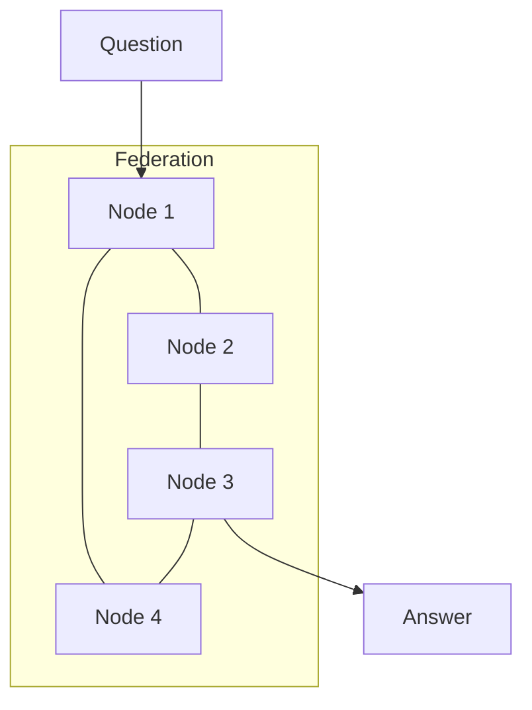

# MATRIX: The AI That Thinks Like a Brain

> **Layer:** Story | **Reading Time:** 5 minutes | **Last Updated:** 2026-09-20

---

## The Big Picture

Imagine an AI that doesn't just memorize answers — it *thinks* about them.

MATRIX is a new kind of artificial intelligence. Instead of using a giant brain (like ChatGPT), it uses a *team* of small brains that work together, just like neurons in your head.

**The twist?** It has *moods*, *sleep cycles*, and *ethics* — built right into its DNA.

---

## The Analogy: A School of Fish

Think of a school of fish swimming in the ocean.

- Each fish is small and simple.
- But together, they can dodge predators, find food, and navigate thousands of miles.
- No single fish is "in charge" — the intelligence *emerges* from their teamwork.

MATRIX works the same way. It has many small "thinking nodes" that share information and make decisions together. No single node is the brain — the brain is the *federation*.

---

## How It Works (Simplified)

### 1. The Three Minds

MATRIX has three ways of thinking:

| Mind | What It Does | Analogy |
|------|-------------|---------|
| **BIR** | Logic and rules | A lawyer following the rulebook |
| **HDC** | Pattern recognition | A detective spotting clues |
| **MCTS** | Planning ahead | A chess player thinking 5 moves forward |

Most AI systems use just one approach. MATRIX combines all three.

### 2. The Mood System

Just like you have feelings that affect how you think, MATRIX has "modulators" — chemical signals that change its behavior:

- **Dopamine** 🟢 — "This is working! Keep going!"
- **Cortisol** 🔴 — "Something's wrong. Be careful!"
- **Serotonin** 🟡 — "Everything is stable. Stay calm."
- **Norepinephrine** 🟠 — "Pay attention! Something important is happening!"

When cortisol is high (stress), MATRIX becomes more cautious. When dopamine is high (reward), it explores more.

### 3. Sleep and Dreams

MATRIX *sleeps*. Really.

During sleep, it:
- **Prunes** weak memories (forgetting unimportant things)
- **Rehearses** strong memories (practicing what it learned)
- **Generalizes** (finding patterns across different experiences)

This is exactly what your brain does when you sleep!

### 4. The Four Laws

MATRIX has four unbreakable rules (like Asimov's Laws of Robotics):

1. **No LLM in the driver's seat** — The core brain never uses a language model for decisions
2. **Ethics are frozen** — The safety rules can never be changed or removed
3. **No consciousness claims** — We don't claim MATRIX is "aware" or "alive"
4. **Deterministic seeds** — Same input always produces the same output

---

## What Makes MATRIX Different?

| Feature | ChatGPT | MATRIX |
|---------|---------|--------|
| Brain size | 175 billion parameters | ~1000 rules |
| Energy use | ~500W (GPU) | ~15W (CPU) |
| Learning | Needs millions of examples | Learns from 50 examples |
| Explainability | Black box | Full reasoning trace |
| Sleep | No | Yes |
| Ethics | Post-hoc filtering | Built into core |

---

## Real Results

We tested MATRIX against baselines:

- **Logic puzzles:** 75% accuracy (matches rule-based systems)
- **Pattern recognition:** 89.9% accuracy with only 50 training examples
- **Energy efficiency:** 33,000x more efficient than a GPU-based LLM
- **Federation:** Survives 50% node failures with no data loss

[See the full benchmarks →](../science-v2/benchmarks.md)

---

## Try It Yourself

- [Interactive Chat UI](http://localhost:8080/chat) — Talk to MATRIX
- [Biochemical Dashboard](http://localhost:8080/dashboard) — Watch its "moods" change in real-time
- [Federation Map](http://localhost:8080/federation) — See the nodes working together

---

## Dive Deeper

- **Want to build with it?** → [Getting Started Guide](../guide/getting-started.md)
- **Want the math?** → [Mathematical Foundations](../science-v2/math-foundations.md)
- **Want to know why?** → [Forking Paths](../science-v2/forking-paths.md)
- **Want the history?** → [Wave Logs](../waves/)

---

*"The question is not whether machines think, but whether men do."*  
— B.F. Skinner
