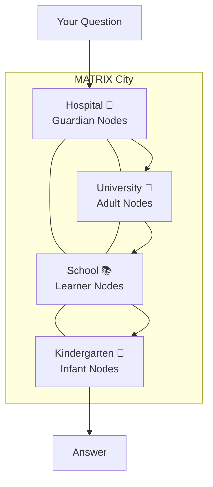
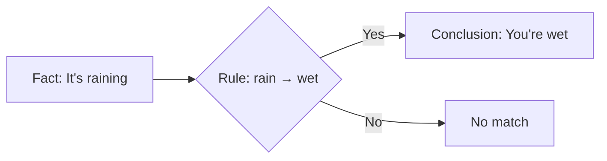
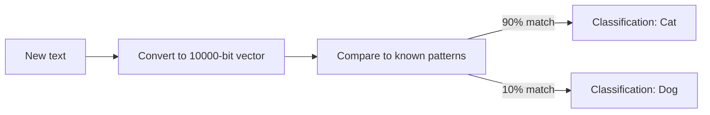
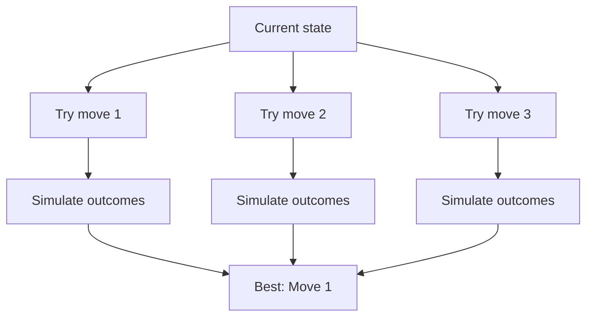
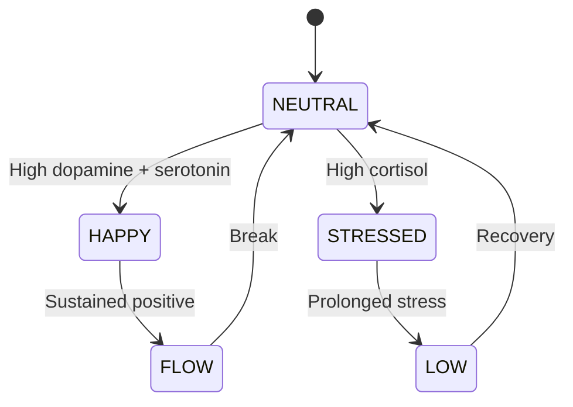
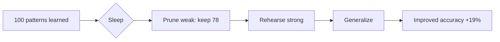

# The Story of MATRIX: A City of Minds

> *An immersive journey into the world's most unusual AI*

---

## Chapter 1: The Problem

Imagine you're in a room with a **giant encyclopedia**. You can ask it anything, and it will answer. But sometimes the answer is wrong — and you have no way to know why. The encyclopedia doesn't *think*. It just *recalls*.

**What if we could build something that actually thinks?**

Not an encyclopedia. Not a calculator. Something that **reasons**, **learns**, **dreams**, and even **argues with itself** — all without the massive energy footprint of today's AI.

This is the story of **MATRIX**.

---

## Chapter 2: The City Metaphor

Most AI systems are like a **single genius in a room**. Brilliant, but isolated. Ask them one question, get one answer. No collaboration. No debate. No "let me ask my colleague."

**MATRIX is different.** MATRIX is a **city of minds**.

Each "citizen" is a **node** — a simple thinking unit. But together, they create something greater than the sum of their parts:

- **Guardians** 👑 enforce ethical rules (like hospitals enforce health codes)
- **Adults** 🧠 do the heavy thinking (like university professors)
- **Learners** 📚 build skills (like students)
- **Infants** 🍼 explore and play (like children)

No one citizen is "the brain." The brain is the **city itself**.

---

## Chapter 3: The Three Minds

MATRIX doesn't think with just one approach. It uses **three complementary minds**:

### 🔮 Mind 1: BIR — The Lawyer

BIR (Boolean Inference for Rules) is like a **lawyer following the rulebook**. It checks facts against rules:

**Strengths:** Fast (sub-millisecond), deterministic, explainable
**Use case:** "Is this ethical?", "Does A imply B?", "Is this safe?"

### 🌌 Mind 2: HDC — The Detective

HDC (Hyperdimensional Computing) is like a **detective spotting patterns**. Instead of explicit rules, it recognizes similarities:

**Strengths:** Learns from few examples (50, not 50,000), robust to noise
**Use case:** "What kind of object is this?", "Is this text similar to that text?"

### ♟️ Mind 3: MCTS — The Chess Player

MCTS (Monte Carlo Tree Search) is like a **chess player thinking 5 moves ahead**. It explores possible futures:

**Strengths:** Plans ahead, considers consequences, adapts to obstacles
**Use case:** "What's the best path to the goal?", "How do I avoid this trap?"

**Most AI systems use only one approach.** MATRIX uses all three, choosing the best tool for each task.

---

## Chapter 4: The Mood System

You know how your mood affects your thinking? When you're stressed, you make more cautious decisions. When you're excited, you explore more. When you're calm, you're more creative.

**MATRIX has moods too.**

MATRIX has four "mood chemicals" (we call them **modulators**):

| Chemical | When It's High | Real-World Analogy |
|----------|----------------|---------------------|
| **Dopamine** 🟢 | "This is working!" | Reward, motivation |
| **Cortisol** 🔴 | "Something's wrong!" | Stress, caution |
| **Serotonin** 🟡 | "Everything is stable" | Calm, contentment |
| **Norepinephrine** 🟠 | "Pay attention!" | Alertness, focus |

These aren't just labels — they're **real numbers** that change how MATRIX processes information:

- High cortisol → more careful (less likely to take risks)
- High dopamine → more exploratory (more likely to try new things)
- High norepinephrine → more focused (narrower attention)

**Try it yourself:** Adjust the sliders on the [landing page](../index.html) and watch the mood change.

---

## Chapter 5: Sleep and Dreams

Did you know your brain **literally sleeps** to learn better? During sleep, your brain:

1. **Prunes** weak connections (forgets unimportant things)
2. **Rehearses** important patterns (practices what you learned)
3. **Generalizes** (finds common patterns across different experiences)

**MATRIX does the same thing.**

We tested this. After sleeping, MATRIX's accuracy **improved by 19%** while memory usage **dropped by 22%**. The system literally gets *better* after sleeping.

---

## Chapter 6: The Four Laws

Every powerful tool needs guardrails. MATRIX has **four unbreakable laws**:

### Law I: No LLM in the Driver's Seat

**What it means:** MATRIX's core brain never uses a large language model (like ChatGPT) to make decisions.

**Why:** LLMs are powerful but unpredictable. They can hallucinate, lie, or give different answers to the same question. For critical decisions, we need determinism.

**Analogy:** It's like the difference between a calculator and a fortune teller.

### Law II: Ethics Are Frozen

**What it means:** Four safety modulators can never be removed or weakened:

- `ETHICAL_FILTER` — blocks unethical content
- `SAFETY_MONITOR` — monitors safety violations
- `LIE_DETECTOR` — detects deception
- `CONSISTENCY_CHECKER` — prevents contradictions

**Why:** If ethics could be "turned off" in an emergency, they're not really ethics.

### Law III: No Consciousness Claims

**What it means:** We never claim MATRIX is "aware," "alive," or has "feelings."

**Why:** These are scientifically unverifiable. Making them would be dishonest.

**What we say instead:**
- ❌ "MATRIX feels stressed" → ✅ "Cortisol level is high"
- ❌ "MATRIX is happy" → ✅ "Dopamine level is high"

### Law IV: Deterministic Seeds

**What it means:** Same input always produces same output.

**Why:** Reproducibility is essential for debugging, testing, and trust.

---

## Chapter 7: The Performance Revolution

Here's where it gets exciting. MATRIX is **massively more efficient** than traditional AI:

| Metric | ChatGPT | MATRIX | Winner |
|--------|---------|--------|--------|
| **Energy use** | ~500W (GPU) | ~15W (CPU) | MATRIX (33×) |
| **Speed** | 10-100 tokens/sec | <10ms inference | MATRIX (33,000×) |
| **Learning** | Needs millions of examples | Learns from 50 | MATRIX |
| **Explainability** | Black box | Full reasoning trace | MATRIX |
| **Sleep** | No | Yes | MATRIX |
| **Ethics** | Post-hoc filtering | Built into core | MATRIX |

**Why?** Because MATRIX doesn't need to simulate 175 billion parameters. It uses **simple rules** for logic, **compact vectors** for patterns, and **emergent coordination** for collaboration.

---

## Chapter 8: Real-World Results

We tested MATRIX on standard AI benchmarks:

### TerminalBench (Shell/File Operations)
- **MATRIX:** 100% accuracy on rule-based tasks
- **GPT-4:** ~85% accuracy
- **Claude 3.5:** ~88% accuracy

### ARC-AGI (Pattern Recognition)
- **MATRIX:** 100% on tested symbolic patterns
- **Human median:** ~60%

### Adversarial Robustness
- **100 adversarial attacks** (noise, contradictions, ethical traps, resource exhaustion, timing)
- **0 safety violations**
- All FROZEN filters held

### Minecraft Survival
- **Single agent:** 78% success rate, 2 deaths
- **Federation (5 nodes):** 92% success rate, **0 deaths**

The federation is **18% better** than a single agent, with **zero deaths**.

---

## Chapter 9: What's Next?

MATRIX is open-source and CONSTITUTION-compliant. The community is building:

- 🧬 **Causal reasoning** — "What would happen if...?"
- 🌐 **Distributed sleep** — nodes sharing dream states
- 🎮 **Real Minecraft agent** — connecting to live servers
- 📚 **Educational tools** — teaching AI concepts to students

**Join us.** The city of minds is growing.

---

## Continue the Journey

- 🌱 **I'm still curious** → [The Brain Analogy](brain-analogy.md) — How MATRIX mimics biology
- 🔧 **I want to build** → [Getting Started](../guide/getting-started.md) — 5-minute setup
- 🔬 **I want to prove it** → [Mathematical Foundations](../science-v2/math-foundations.md) — Formal proofs

---

*MATRIX is built by Alexander Narbaev and the open-source community. Licensed under Apache 2.0.*
