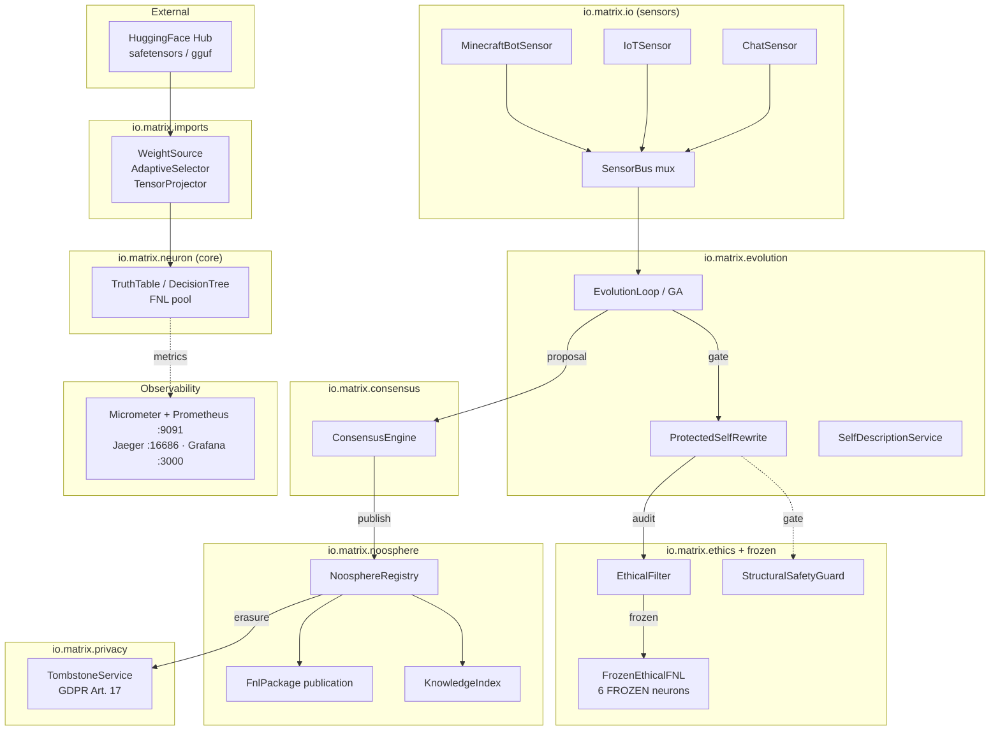

# MATRIX — Architecture Overview (v3.47)

> A high-level map of the runtime architecture. Updated as the codebase grows.

## Runtime architecture

## Subsystem summary

| Subsystem | Package | Responsibility |
|-----------|---------|----------------|
| Neuron core | `io.matrix.neuron` | TruthTable, DecisionTree, BinaryNetwork, FNL pool |
| Evolution | `io.matrix.evolution` | Genetic algorithm (EvolutionLoop, FitnessFn), self-rewrite |
| Ethics | `io.matrix.ethics`, `io.matrix.ethics.frozen` | EthicalFilter, StructuralSafetyGuard, FROZEN FNL network |
| Consensus | `io.matrix.consensus` | Multi-agent consensus (ConsensusEngine, Byzantine) |
| Noosphere | `io.matrix.noosphere` | FNL publication, knowledge index, credit model |
| Sensor / IO | `io.matrix.io` | ChatSensor, IoTSensor, MinecraftBotSensor, SensorBus |
| Weight ingest | `io.matrix.imports` | Universal Weight Importer (HF Hub → TruthTables) |
| Privacy | `io.matrix.privacy` | GDPR Article 17 tombstoning |
| Observability | `io.matrix.observability` | Micrometer / Prometheus / OTEL / Jaeger |
| Snapshot | `io.matrix.snapshot` | Cluster snapshotting |
| Simulation | `io.matrix.simulation` | World model for fitness evaluation |

## Build & deploy

| Stage | Tool | Output |
|-------|------|--------|
| Compile | `javac` (Java 25 LTS) | `matrix-core/target/classes` |
| Test | JUnit 5 + AssertJ | `matrix-core/build/test-results/test/` |
| Coverage | JaCoCo | ≥82% (gate enforced) |
| Benchmarks | JMH | `matrix-core/build/jmh-results.json` |
| Static analysis | SpotBugs | `matrix-core/build/reports/spotbugs/` |
| Native image | Mandrel 25 + GraalVM | `matrix-core/build/*-runner` |
| Docker | Container BuildKit | `matrix-core:<sha>` |
| CI/CD | GitHub Actions (`.github/workflows/ci.yml`) | All checks on push to main |
| Formal specs | TLA+ Toolbox + TLC | `formal/*.tla` |

## FROZEN invariants

Per L7 §3.1 / L5 §5.1, certain values are **structurally immutable** in code:

- `TruthTable.K_MAX = 20` — max inputs per neuron
- `FROZEN_AXIOM_NAMES` — the 6 axiom identifiers (EthicalFilter)
- `FrozenEthicalFNL.neurons` — `Set.copyOf`, never mutated at runtime
- `StructuralSafetyGuard.gatedOperations` — `Set.copyOf`, only via builder
- `BinaryNeuron.immutable` flag — wired in `BinaryNetwork` constructor
- `Epoch_L1.Architecture_K` — cluster topology invariants

## Wave history (this development arc)

| Wave | Theme | New packages / files |
|------|-------|---------------------|
| 1 | Foundation upgrade | Quarkus 3.36.1 → 3.37.3, Mandrel 24 → 25 |
| 2 | Universal Weight Ingestion | `io.matrix.imports` (6 classes, 24 tests) |
| 3 | Sensor / IO evolution | `io.matrix.io` (4 sensors + SensorBus, 24 tests) |
| 4 | Self-Evolution gated | `io.matrix.evolution` (PSR + SDS, 8 tests) |
| 5 | Performance | `BatchEvaluator` + 2 JMH benchmarks |
| 6 | FROZEN FNL | `io.matrix.ethics.frozen` (5 classes, 16 tests) |
| 7 | GDPR Tombstoning | `io.matrix.privacy` (2 classes, 9 tests) |
| 8 | Formal specs | `formal/{MPDTNeuron,Consensus,FrozenEthicalFNL}.tla` + CI |
| 9 | DecisionTree batch | `DecisionTreeBatch` + JMH |
| 10 | Coverage expansion | + NeuralTextGeneratorTest, HuggingFaceHubSourceTest, FitnessFnTest |
| 11 | Architecture docs | this file + ARCHITECTURE.md |

Total: **+30 production classes**, **+85 unit tests**, **+3 TLA+ specs**, **+3 JMH benchmarks**,
**3 new CI workflows** (TLA, native, JVM).

## Touch points for adding a new subsystem

1. Add package `io.matrix.<domain>` with public types matching the existing
   style (sealed interfaces, records, `@ApplicationScoped` Quarkus beans).
2. Wire into the agent loop via `AgentLoop.Sensor` / `Effector` (or
   `SensorBus`).
3. Provide a `*Service` record/event type for observability.
4. If the subsystem touches ethics, run every API entry-point through
   `ProtectedSelfRewrite.gateAndApply`.
5. Tests at ≥82% coverage (JaCoCo gate).
6. Document in `docs/<domain>.md` and update `docs/INDEX.md`.

## See also

- `docs/MASTER_PLAN.md` — high-level project roadmap (L0–L22 layers)
- `docs/CRITICAL_GAPS.md` — code-review findings + closure log
- `formal/README.md` — TLA+ specs and TLC workflow
- `docs/L1_MPDT_neuron.md` — mathematical foundation
- `docs/L7_Ethics.md` — FROZEN ethical contract
